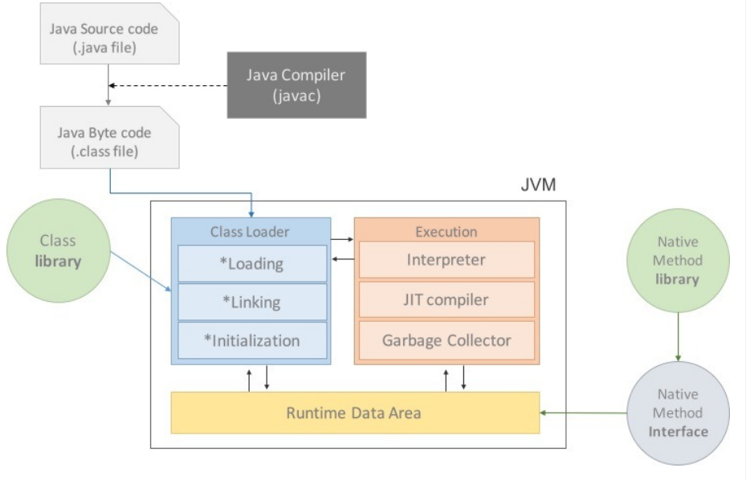

# JVM

## JVM이란

JVM (JAVA Virtual Machine) 자바 가상머신은 JAVA를 실행하기 위한 물리적 머신을 소프트웨어로 구현한 프로그램이다. 프로그램이 실행되기 위해서는 OS에 알맞은 바이트 코드로 전환되어야 하는데, JAVA는 다양한 OS에서 알맞는 바이트 코드를 만들어 주기위해 JVM을 사용한다. 따라서 OS에 상관없이 동작 가능하며, 메모리 관리 등 프로그램 실행에 필요한 기능을 제공한다.

## Java 실행 과정

1. 프로그램이 실행되면 JVM은 OS로부터 프로그램 실행에 필요한 메모리를 할당받는다. JVM은 다시 이것을 나눠서 관리한다.
2. 자바 컴파일러 (javac)가 자바 코드(.java)를 읽어 바이트 코드(.class)로 변환한다.
3. Class Loader를 통해 JVM에 올린다.
4. 로딩된 class 파일을 Execution engine이 해석한다.
5. 해석된 바이트 코드는 Runtime Data Areas에 배치되어 수행된다. 
6. 실행 과정에서 필요에 따라 Thread synchronization과 GC 같은 작업이 수행된다.

## JVM 구성

### Class Loader (클래스 로더)

JVM 내로 클래스 (.class) 파일을 로드하고, 링크를 통해 배치하는 작업을 수행한다. Runtime 시 동적으로 클래스를 로드한다. jar 파일 내 저장된 클래스들을 JVM 위에 탑재하고 사용하지 않는 클래스를 메모리에서 삭제한다. 

### Execution Engine (실행 엔진)

클래스를 실행시킨다. 클래스 로더가 JVM에 파일(바이트 코드)를 배치시켰다면, 실행 엔진은 이를 실행하는 역할이다. 

### JIT (Just - In - Time)

인터프린터 방식의 단점을 해결하고자 만들어진 컴파일러이다. 인터프리터 방식으로 한줄씩 컴파일 하다가 적절한 시점에서 바이트 코드 전체를 컴파일하여 네이티브 코드로 변경하고, 이후에 바로 네이티브 코드를 실행한다. 네이티브 코드는 캐시에 보관되어 빠르게 실행된다. 

### Runtime Data Area

