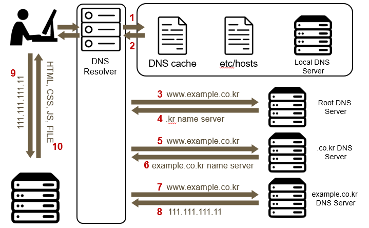

# DNS

### DNS 란

Domain name system (DNS)는 호스트 도메인 네임을 통해서 호스트 네트워크 주소를 찾기 위한 시스템이다. 숫자로 이루어진 IP를 사람이 기억하기 어렵고 편리하지 않기 때문에 도메인 주소를 사용하고, 실제 네트워크 주소는 DNS를 이용해서 찾는다.

### DNS 과정

찾으려는 Domain 주소를 입력하면 DNS Resolver에 적힌 순서대로 처리된다. 이 순서는 바뀔 수 있으며, 리눅스의 경우 resol.conf에서 확인할 수 있다.

우선 Local OS에 저장된 DNS cache를 조사한다. 여기서 캐쉬가 있으면 바로 IP를 찾아서 해당 서버에 요청한다. 여기에 IP가 없다면 hosts 파일을 참고한다. hosts 파일은 유저가 직접 도메인에 해당하는 IP주소를 적어두는것이다. 여기에도 IP가 없다면 Local DNS Server에 IP를 요청한다.

Local DNS Server는 컴퓨터 네트워크 설정에 기본적으로 되어있다. 보통은 인터넷을 제공하는 통신사에 연결된 DNS 서버를 이용한다. 여기에도 도메인이 없다면 전세계에 13개만 있다는 Root DNS Server에 이동한다. 여기서 호스트를 전송하면 com / kr 과 같이 가장 오른쪽에 있는 도메인을 담당하는 DNS 서버 주소를 알려준다. 여기서 하나씩 내려가면서 도메인을 찾아가서 최종적으로 IP주소를 찾을 수 있다.

이를 수신한 Local DNS Server는 IP정보를 캐싱하기도 한다. 내가 사용하는 컴퓨터 역시 DNS cache에 DNS 서버를 저장한다.
