# 컴퓨터네트워크 기본 9~14강

> 본 글은 KOCW 이석복 교수님의 강의를 정리한 기록입니다. 
> 강의와 자료는 무료로 공개되어 있습니다.
> (링크: http://www.kocw.net/home/m/search/kemView.do?kemId=1169634)

### 네트워크 전송

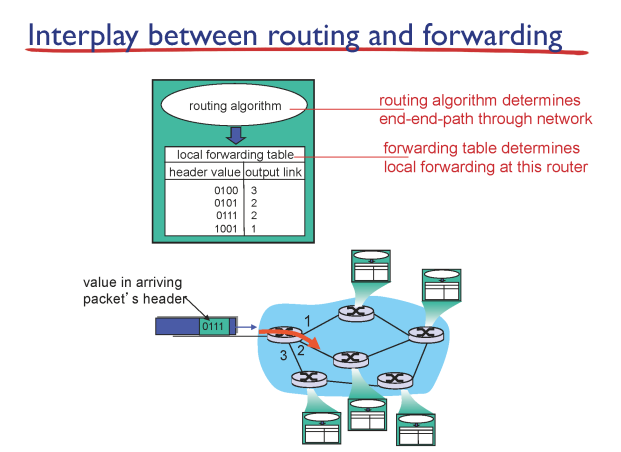

- 네트워크 계층은 전송계층(TCP/UDP 있던) 아래에 있다. 실제로 패킷을 목적지에 도달시키는 역할을 한다.
- 여기서 프로토콜은 IP (Internet protocol)이라고 한다.
- 라우터는 라우터 포워딩 테이블과 알고리즘을 가지고 입력을 알맞는 결과로 보낸다.
- 그럼 이 테이블은 누가 만들까? 자동적인 라우터 알고리즘을 통해서 생성된다.
- 포워딩 테이블은 우체국에서 주소를 구분하는것처럼 적당한 범위로 나눠서 보낸다. 
  구간으로 잘라서 트리같이 보낸다고 생각하면 좋다.

#### 포워딩 테이블 원리

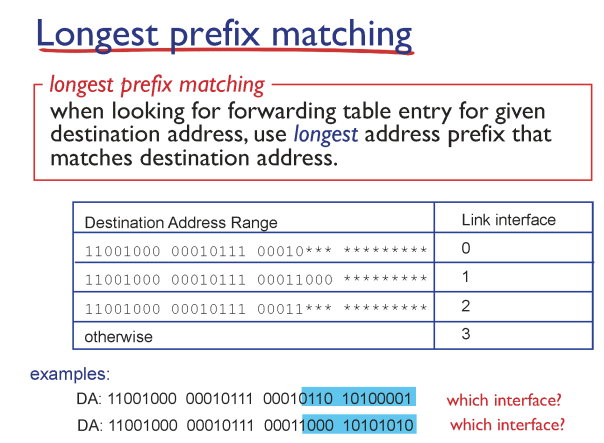

이렇게 테이블을 가지고 프리픽스 (앞부분) 일치를 확인해서 보내는 방식이다.

이를 롱기누스 프리픽스 메칭이라고 한다.

### IP 구조

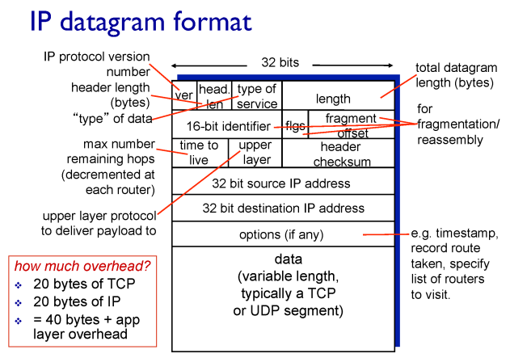

- 현재 IP 버전은 4이다.
- Time to live는 라우터를 지날수록 1씩 감소한다. 순환 루프에 빠지면 버려지기 위해서 이게 0이 되면 사라지도록 장치를 만드는것이다.
- upper layer는 TCP/UDP를 구분한다. 이는 리시버가 사용한다.
- IP는 20 bits, TCP 20 bits = 40 bits 해더가 네트워크를 주로 돌아다닌다.

### IP 주소

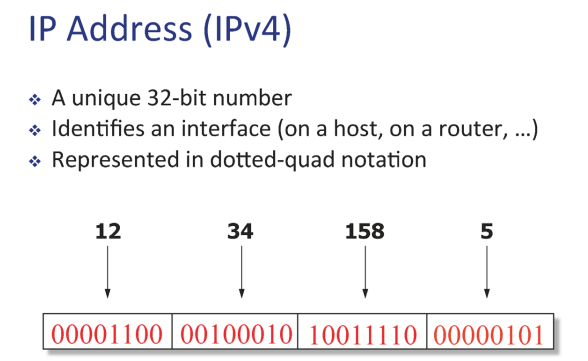

- IP는 32 bits이다. 사람이 읽기 좋게 8비트씩 10진수로 표현한것 뿐이다.
- 이는 NIC (network interface card)를 인식하는 주소이다. NIC가 여러개 있으면 하나의 컴퓨터가 여러개 IP를 가질 수 있다. 대표적인 예시가 라우터이다.

### IP 주소 배정

#### 네트워크 주소란

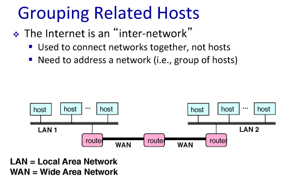

- IP는 랜덤하게 배정하면 라우터 내부의 포워딩 테이블이 귀찮게 된다. 따라서 물리적 범위가 모여있는곳에 비슷한 IP 주소를 배정한다. 즉, 계층화를 사용한다.

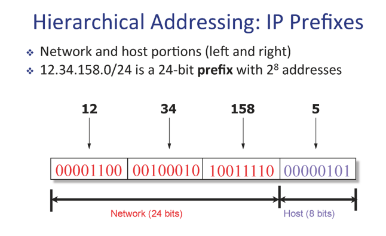

- 앞부분은 네트워크, 뒷 부분은 호스트를 나타낸다. 같은 공간에서 같은 네트워크를 가지도록 정의한다.
- 이를 네트워크 ID라고 부르고 IP prefix라고도 부른다.
- 여기서 네트워크를 나타내는 Subnet Mask는 11111111.11111111.11111111.00000000 이다.
  즉, 255.255.255.0이다. Subnet Mask를 곱연산하면 Network IP만 나온다.
- Subnet은 같은 Prefix를 가진 디바이스 공간이다. 다른말로, 여기 내부에서는 라우터를 거치지 않고 서로 접근이 가능하다.

#### IP 주소 배정을 어떻게 할까

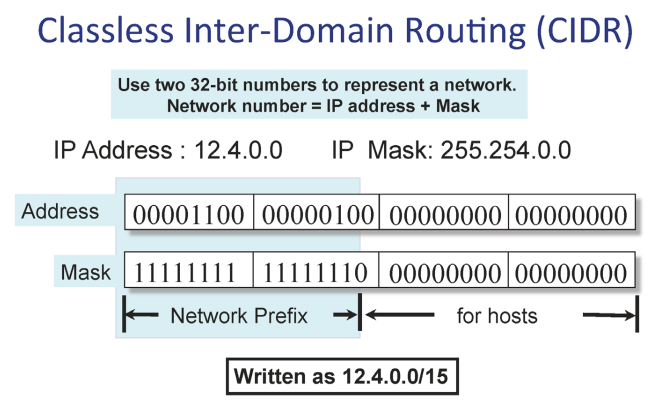

- 이전에 Class A,B,C를 통해서 네트워크 공간과 호스트를 분리하였다. 이랬을때 공평 분배 문제가 있어 효율적이지 못했고, 따라서 CIDR이 탄생했다.

- 가장 큰 변화는 8 bit 단위로 끝었던 Class 배정과 다르게 자유롭게 prefix를 나눌 수 있다. 
  위 예에서는 15개를 기준으로 끊었다.

  

### IP 주소공간 공유

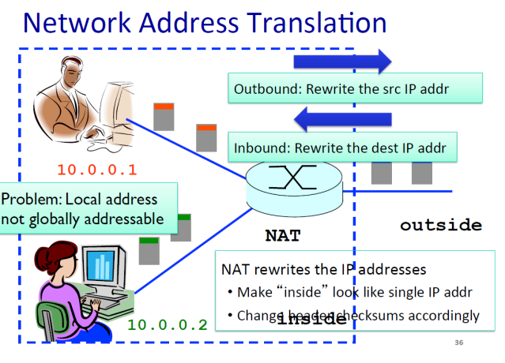

- IPv4는 40억개 정도의  배정이 가능하며, 따라서 공유하지 않는다면 개수가 부족하다.
- NAT방식을 사용해서 이를 해결하였다.

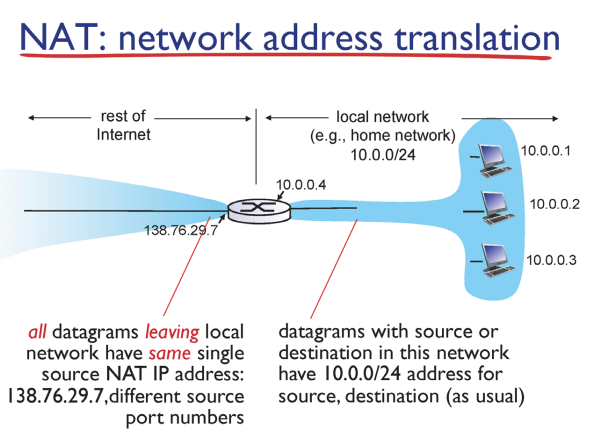

- 오른쪽은 기관에서 내부적으로 사용하는 IP들이다. 내부에서 이 IP를 사용하며 외부로 나갈 경우에 라우터 IP로 변경하는 방식이다.
- 라우터에서 맵핑은 포트 번호로 이뤄지며 로컬에서 나간 전송이 각 포트에 맵핑된다.
- 여기서 첫번째 문제는, 라우터가 본연의 기능을 넘어서 IP를 변경시킨다는 문제가 있다. 또한, 내부 포트 번호를 유지시킬 수 없기때문에 포트 사용이 어렵다는 문제가있다. 따라서 근본적인 해결이 아니다.
- 즉 IPv4는 근본적인 해결을 요구한다.

### IP 정보들을 어떻게 정할까

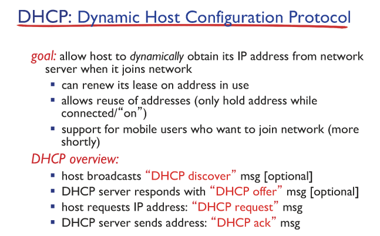

- 사용자가 인터넷을 연결하면 DHCP 프로토콜에 따라서 연결 정보를 만들어준다.
- 유동 IP와 고정IP의 차이로 여기서는 유동 IP에 해당한다.

#### 그럼 DHCP는 어떻게 나를 찾아서 넣어줄까

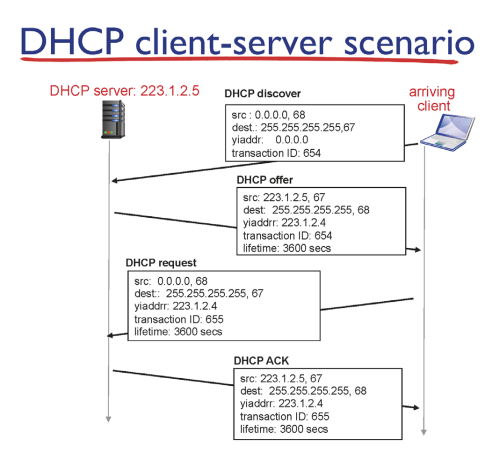

- 컴퓨터를 키고 개인은 DHCP discover를 67포트로 모두에게 요청을 보낸다. 
- DHCP는 빼고 67port를 열지 않기때문에 다 사라지고, DHCP만 이 요청을 듣고 알맞는 응답을 보낸다.
- 그럼 DHCP는 모든 사용자들에게 68포트로 결과를 보낸다. 여기에 보낸사람이 transaction ID를 이용해서 알맞게 찾아서 받는다.
- 개인이 이 DHCP offer가 맘에들면, transaction ID 를 하나 증가시켜서 보내고, DHCP도 ACK를 보내면서 모든 과정이 종료된다.
- 많은 경우 DHCP 서버를 라우터에 기능하게 둔다.

### IPv6

- 주소가 128 bits이다. 아직은 넉넉하다고 본다
- 아직은 전환되지 않은 기술이다. 과도기가 필요하고 어덯게 변환시킬지 방법이 나오지 않았다.

### 라우팅 알고리즘

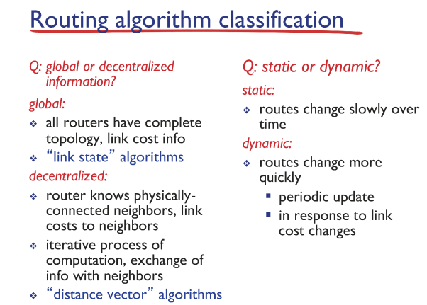

- link state
  - 모든 노드들이 자기 정보를 전체 네트워크에 뿌려줘야 각 노드가 전체를 알 수 있다.
  - 노드들은 전체 정보를 가지고 다익스트라 알고리즘을 통해서 최단 거리를 구한다.
  - 현실적으로 모든 라우터의 거리를 알 수 없다. 따라서 지역적인 범위에서 사용한다.
  - 또한, 모든 라우터가 동일한 알고리즘을 사용한다는 보장이 없다. 
- distance vector
  - 분산처리 방식으로 직관적이지 않다.
  - 내가 가진 거리 정보를 나와 연결된 노드에게 전달한다는 뜻이다. 즉, 하나의 노드는 주위 노드의 정보만 가지게된다.
  - 자신의 거리 정보가 업데이트되면 이웃 노드들한테 새로운 정보를 전달한다.

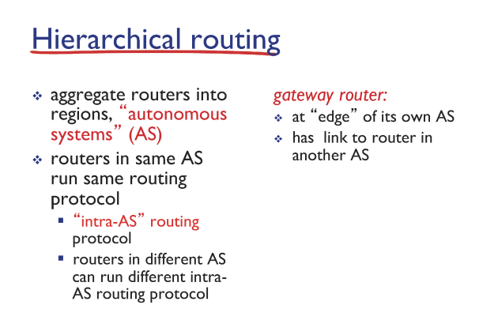

- 지금까지 라우팅 알고리즘은 내부 라우터들끼리의 알고리즘이다. intra-autonomous system이라고도 부른다.
- 각자 내부에서 자발적으로 동작하는 시스템이라는 소리다.
- 전세계적인 라우터 방은 inter-AS 라우팅 알고리즘을 사용한다.

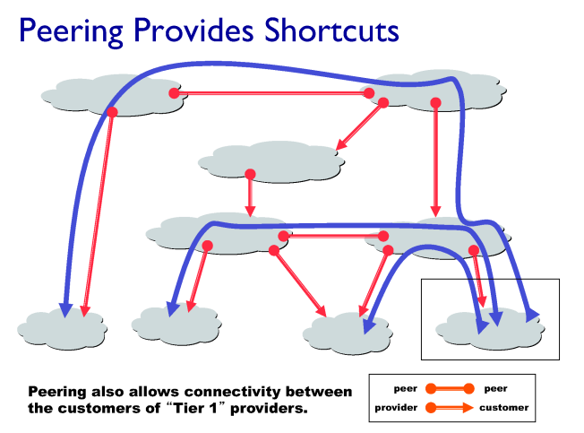

- 위에서 공부한 Intra-AS는 계층적으로 위로 확장된다.

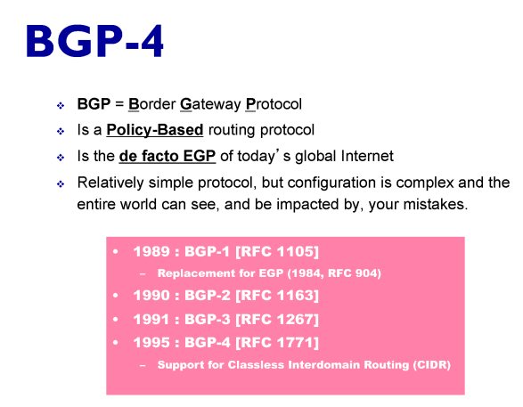

- 최적화는 AS간의 정책에 따라서 결정된다.

