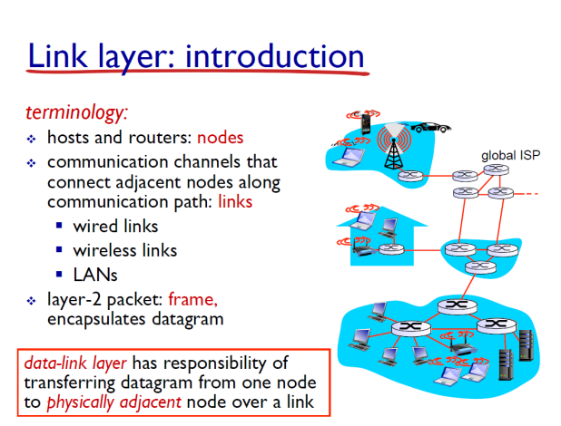
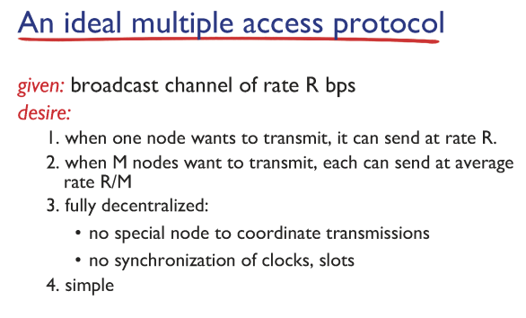
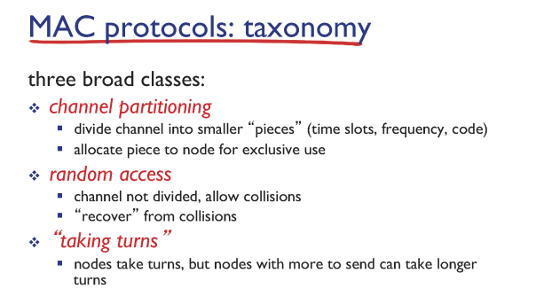
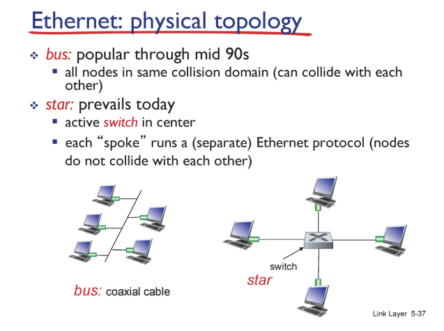
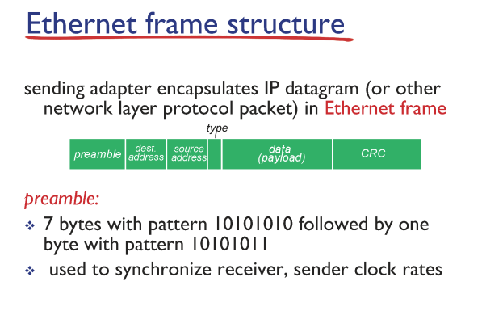
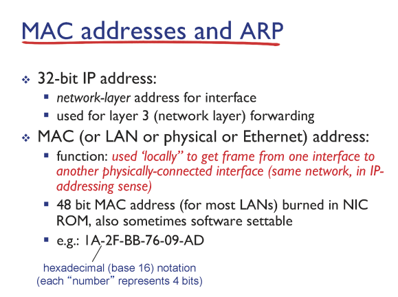
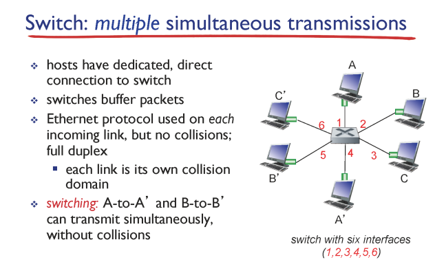

# 컴퓨터네트워크 기본 15~17강

> 본 글은 KOCW 이석복 교수님의 강의를 정리한 기록입니다. 
> 강의와 자료는 무료로 공개되어 있습니다.
> (링크: http://www.kocw.net/home/m/search/kemView.do?kemId=1169634)

### Link Layer

- 링크 레이어는 네트워크 계층 (IP) 아래에 있다.
- 여기서부터는 물리적인 범위로 모든 전파가 브로드케스트 된다.
- 여기서는 MAC protocol이 대표적이다. (WiFi도 이에 해당한다.)

### 이상적인 MAC protocol

- MAC 에서 가장 중요한 기능은 충돌(간섭)을 해결하는것이다.
- 물리적으로 브로드케스팅 되는 정보들을 구분해서 네트워크에 전달한다.

### 대표적으로 중요한 MAC protocol들

- 이렇게 큰 흐름이 있었다.
- Channel partitoning 
  - TDMA(time division multiple access)
    - 유저 시간 (차례)을 정해서 그 시간에만 사용할 수 있게 한다.
    - 그 시간에 사용하지 않는다면 자원이 낭비되는 단점이 있다.
  - FDMA(frequency division multiple access)
    - TDMA와 유사하다.
    - 시간이 아닌 주파수 영역을 지정하여 보낸다.
- Random access
  - 내가 보내고싶을때 보내고 싶다. 충돌은 해결해주겠다.
  - CSMA(carrier sense muliple access)
    - 짐을 담은 매체(carrier)를 확인하겠다.
    - 누군가 매체에서 통신하고 있다면, 나는 멈추고 매체가 조용해지면 그때 전송하겠다는 방식이다.
    - 단점은 동시에 둘이 전송을 시작할때 충돌이 날 수 있다.
      충돌을 서로 감지하면 둘다 전송을 멈추고 조율한다. 이를 CSMA/CD 라고한다.

### LAN (이더넷)

- 예전에는 Bus 형태로 되어있으나 요새는 switch 형태로 LAN을 구성한다.

- 헤더 + 데이터로 구성된다.
- 이더넷은 CSMA/CD를 사용한다.

- 여기서 MAC address를 사용한다. 이는 물리적 주소이고 기기 고유 값이다.
- 전송을 위해서는 내 MAC주소와 라우터의 MAC주소를 알아야한다.
  우리는 라우터의 IP는 알지만 MAC은 알지못한다.
  ARP(IP주소 - MAC주소) 표를 이용해서 주소를 알아낸다. 이는 내가 가지고있다.
  ARP 프로토콜이 이표를 관리해준다.

### 스위치

- 여기서는 유선 이더넷을 의미한다.
- 스위치를 이용하면 물리적인 브로드케스팅이 발생하지 않아 충돌을 예방할 수 있다.
- 스위치는 전송이 겹치지 않게 교통정리를 한다. 하지만 각 PC는 그것을 신경쓰지 않는것처럼 보인다.
- 스위치는 자기 테이블을 가지고 각각 MAC을 저장하며, 모르는 키가 나오면 전체에게 보내서 셀프 학습을 한다.
- 스위치는 여려개의 스위치에 연결 될 수 있다. 즉, 트리 구조를 가질 수 있다.

