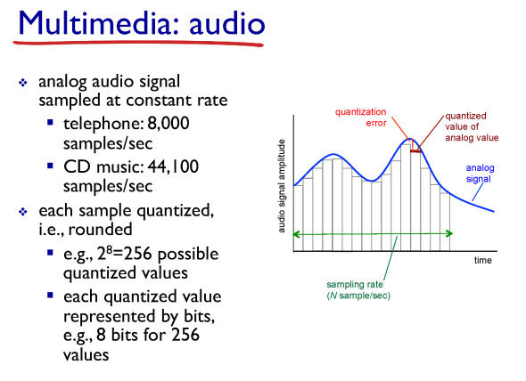
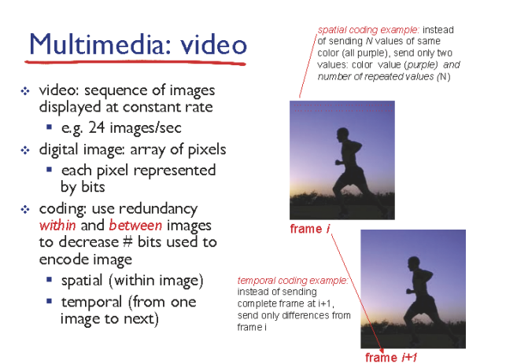
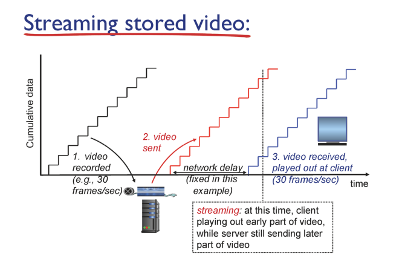
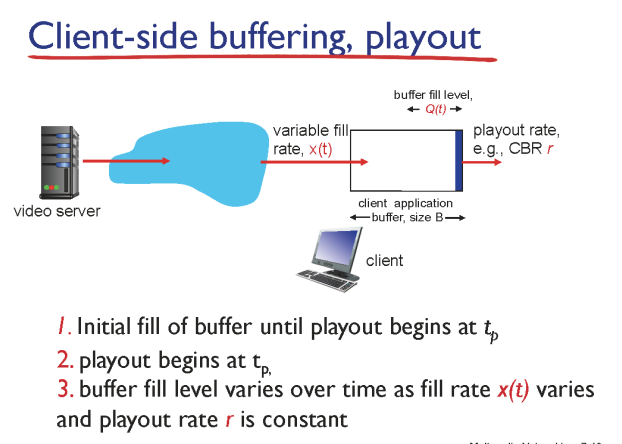
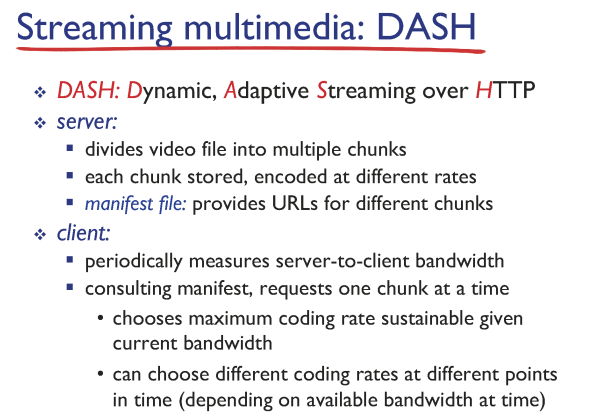
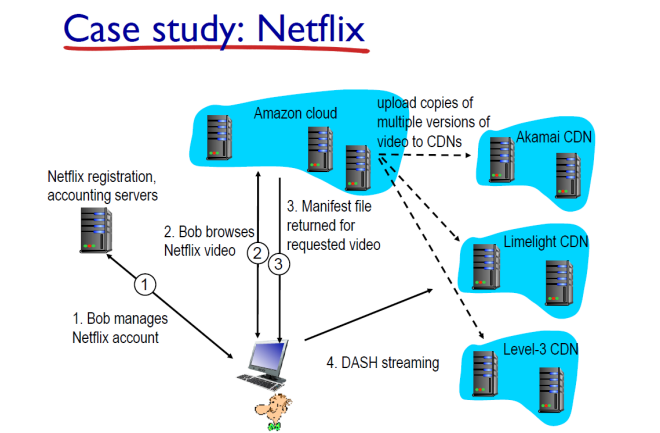

# 컴퓨터네트워크 기본 21강

> 본 글은 KOCW 이석복 교수님의 강의를 정리한 기록입니다. 
> 강의와 자료는 무료로 공개되어 있습니다.
> (링크: http://www.kocw.net/home/m/search/kemView.do?kemId=1169634)

### 오디오

- 오디오를 어떻게 전송하면 좋을까? 아날로그 신호를 디지털 신호로 어떻게 전송할까?
- 전송간격은 어느정도로 해야할까? 전송시간 간격이 작을수록 데이터양이 늘고 음질이 좋을것이다.
  - mp3, cd 등 매체별로 샘플링 주기가 다르다.

### 비디오

- 비디오는 음악+그림의 연속이다. 
- 특징으로는 그림의 픽샐은 이웃한 정보가 비슷하기때문에 압축이 가능하다.

### Buffering

- 가장 이상적인 그림이다. 하지만 이렇게 네트워크가 좋지않다
- 이렇게 동시에 안되기때문에 버퍼링 시간을 가지고 미리 데이터를 불러와서 보내주는 방식을 취한다.

- 결국 멀티미디어 전달의 핵심은 Buffer가 비어있게 하지 않는것이다.
- 우선 UDP vs TCP 중 뭐가 좋을지 생각해보자. UDP는 전송 속도를 전달할 수 있으나 네트워크 상태를 알 수 없기때문에 안전한 전송을 보장하지못한다. 
  - Youtube 경우에는 DASH를 사용한다. 

### DASH

- 영상을 전달한다고 할때, 영상의 시간과 퀄리티를 표로 만들어서 넘겨준다.
- 이는 영상 조각 (청크)가 담겨있고, URL 형태로 담겨있는다.
- 처음에는 퀄리티가 낮은 영상 조각이 담긴 URL을 사용해서 데이터를 받아오다가, 네트워크가 좋다고 판단되면 퀄리티가 점점 높은 URL을 선택하는 방식이다. 이때 네트워크 문제가 생기면 다시 퀄리티를 낮춘다.

### 네트워크 분산

- 네트워크 상으로 가까운 위치에서 데이터를 전달할 수록 유리한다.
- 이는 물리적이라기 보다는 논리적인 위치에서 같은 망에 유지시킬 수록 유리하다.
- 넷플릭스는 자기 서버가 적고, 아마존과 CDN업체로 관리한다. 넷플릭스 서버는 계정 정보와 DASH 테이블만 관리하고 나머지 영상 서버는 클라우드로 관리한다.

