# 컴퓨터네트워크 기본 18~20강

> 본 글은 KOCW 이석복 교수님의 강의를 정리한 기록입니다. 
> 강의와 자료는 무료로 공개되어 있습니다.
> (링크: http://www.kocw.net/home/m/search/kemView.do?kemId=1169634)

### 이전 복습

- 이전 강의에서 학습한 Link Layer에 연장선으로 무선이동네트워크를 학습힌다
- Link Layer는 Mac procotol (CSMA/CD)이 대표적이다.
  - Carrier Sense Multiple Access / Collision Detection
  - 회선의 상태에 따라 누구든 동시에 접근 할 수 있으며, 충돌을 검사하여 제어하겠다.

### 무선네트워크 훝어보기

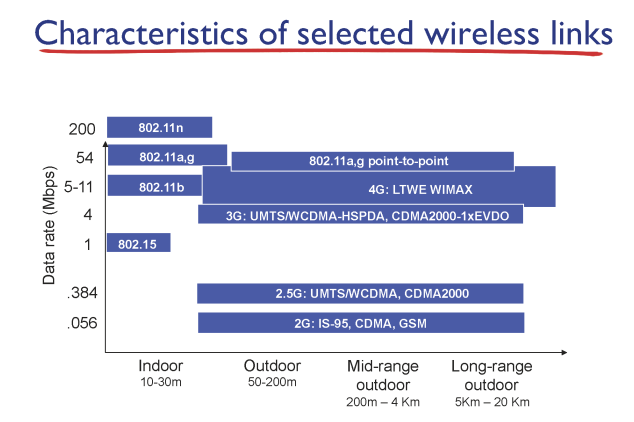

- 802는 와이파이라고 본다.
- 와이파이가 점점 발전될수록 속도는 빨라지나 반경은 작아지고있다.

### 무선네트워크 특성

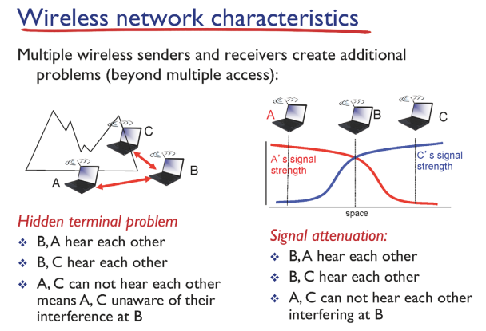

- 유선인터넷은 케이블을 통해 신호가 전달된다. 이는 외부 노이즈로부터 보호된다. 

  따라서, 거리가 증가하더라도 손실이 적다.

  무선의 경우에는 거리가 증가하면 손실이 크게 발생해서 확 시그널이 떨어진다.

  따라서, 네트워크 상태를 기기가 알수없으므로 MAC protocol을 사용할 수 없다.

  이러한 문제를 Hidden terminal problem이라고한다.

### 와이파이

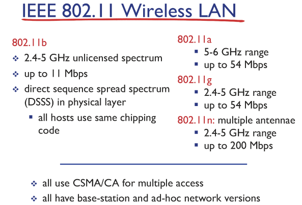

- 정식명칙은 IEEE 802.11 이나 WiFi라고 별칭으로 부른다.
  - HiFi라고 오디오 업계에서 원음에 가까운 소리를 전송하자는 기술이 있다. 이당시 이를 모방해서 마케팅적으로 이름을 정했다는 이야기가 있다.
- 버전이 올라갈 수록 data rate가 상승하고있다.

### 와이파이 architecture

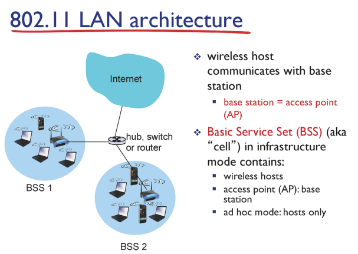

- Positive scanning

  - 모든 기기는 자신의 정보를 담아서 주기적으로(초당 10~100번) 주변 기기에게 전송한다. 

    이러한 주변 단위를 BSS이다.

  - 이러다가 가장 세기가 좋고 믿을만한 AP에게 내 신호를 전달한다.

### Multiple access

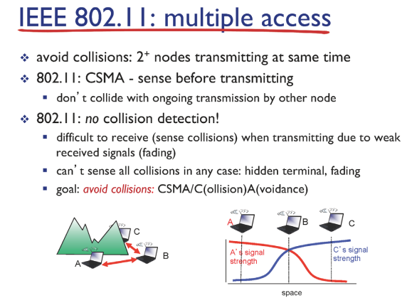

- 유선에서 배운 CSMA/CD는 충돌을 발생시키지 않기위해 네트워크를 듣고있다가 조용할때 내 페킷을 보낸다.

  따라서 충돌이 발생하지 않고 ACK를 확인할 필요가 없다.

- 반면, 무선은 네트워크가 조용한지 알 수 없다. 따라서 내 페킷이 재대로 갔는지 알기 위해서 ACK를 받아야한다. 이는 TCP에서 ACK와 완전히 다른 개념이다. 여기서 ACK는 Link layer에서 잘 도착했다는것을 확인해주는 응답이다.

- 무선에서 사용하는 프로토콜은 CSMA/CA이다.

### CSMA/CA

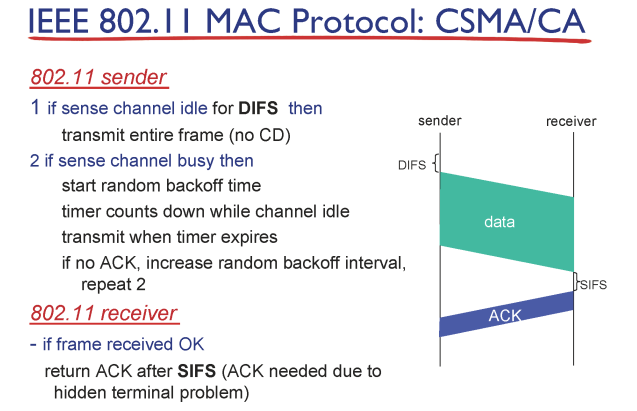

- sender는 difs로 네트워크를 듣다가 조용하다 생각하면 데이터를 보내고 ack를 기다린다.
  - 유선에서는 데이터를 보내다가 충돌이 감지되면 바로 멈춘다. 반면 무선은 멈추는 개념이 없다.
  - 따라서 무선이 네트워크에 낭비하는 자원이 많다. 그래서 충돌을 안나게 설계해야한다.
  - 이를 위해 CSMA/CA에 RTS-CTS를 추가시켰다.
- receiver는 데이터를 확인하고 sifs를 기다린후 ack를 보낸다.

### RTS-CTS

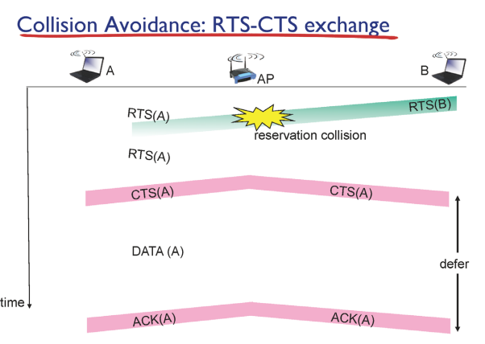

- RTS: 주변 기기에 데이터 보내고싶다고 알리는 컨트롤러
  - 조그만한 데이터를 던저서 보낼 수 있을지 응답을 확인함
  - 얼마나 큰 데이터를 얼마만큼 보내겠다는 정보가 있다
- CTS: 주변 기기가 알았다고 데이터 보내라고 허락해주는 컨트롤러
- 과정
  1. A가 RTS를 보냈는데 아무 반응이 없다면 충돌이 발생했다 생각하고 랜덤 시간 기다린 후 다시 보낸다.
  2. CTS는 거리가 멀어서 RTS를 못들은 기기도 있기때문에 전체로 다시 보내주고 이를 들은 A는 데이터를 보낸다.
  3. 다른 기기들은 CTS를 들었기 때문에 데이터를 보내지 않는다.
  4. AP가 전체에 ACK를 보내기때문에 전체는 전송이 끝났다는것을 알 수 있다.

### 802.11 주소

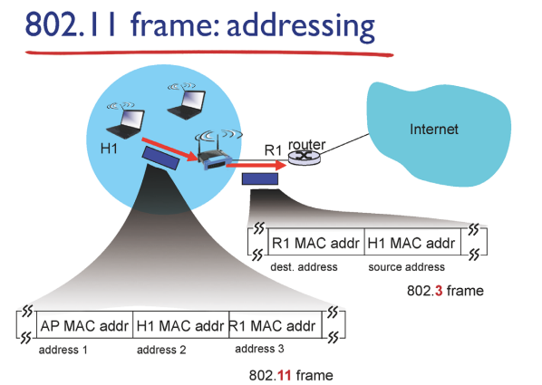

- 전송을 생각해보면 무선과 유선이 결합된 환경에서 전송된다.
- 즉, 프로토콜은 유무선이 결합되어 있어야한다. 이를 위해서 3개의 주소 공간을 사용한다.

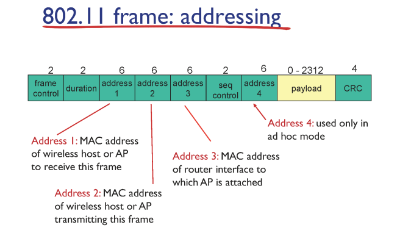

- 유선과 다르게 다양한 정보들이 들어간다.

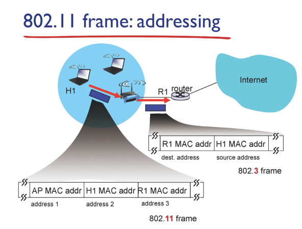

- 유선 상황에서는 무선 IP address를 이해하는 방법이 없다. 이는 라우터에서나 이해할 수 있다.
- 3개의 address가 필요한 이유는 무선 IP에서 유선 주소까지 알려줘야 라우터까지 도달할 수 있기 때문이다.

### Mobility

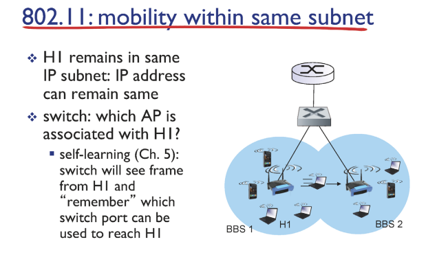

- 연결은 TCP에서 사용하는 개념이다. 이는 Client의 소켓과 Sender의 소켓과의 연결이다.
- 이동중에 Client에서 바뀌는것이 무엇인지 알아야한다.
  - H1이 변경되고 나머지는 다 같다.
  - switch는 switch table을 참조해서 BBS 라우터에 보내게 되는데, H1이 이동하면서 swtich table만 변경하면된다.
  - switch는 witch table을 self learn해서 업데이트 시킨다. 따라서 기기가 이동하면서 router에 더미 메세지를 지속적으로 보내는데 이를 통해서 self learn되어 변경을 감지하고 테이블을 변경한다.

### Capability

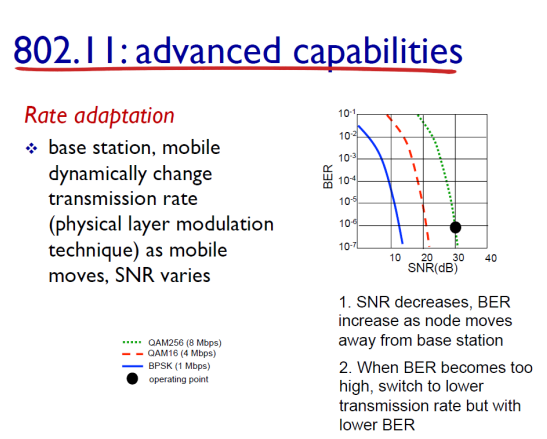

- 무선채널의 성능은 SNR로 나타낸다. 이는 시그널/노이즈 비율이다. 노이즈에 비해 시그널의 비율이 높은것이 더 좋은 신호라고 볼 수 있다.
- 우리가 보내는 0111000 같은 비트 신호는 실제 물리 세계에서는 파장으로 전달된다. 어느정도 길이의 파장에 어느정도 양의 데이터를 담을지는 약속으로 정한다. 위 그래프가 그것을 나타낸다.

### 통신 G

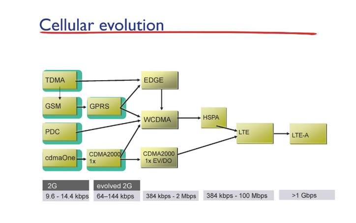

- 3G, 4G 이런 개념은 속도에 상대되는 개념이다. LTE는 4G 중 하나의 기술이다.
- 이는 마케팅에 해당하여 정확하게 해당 G 속도가 아니더라도 기업에서 붙여서 팔기도한다.

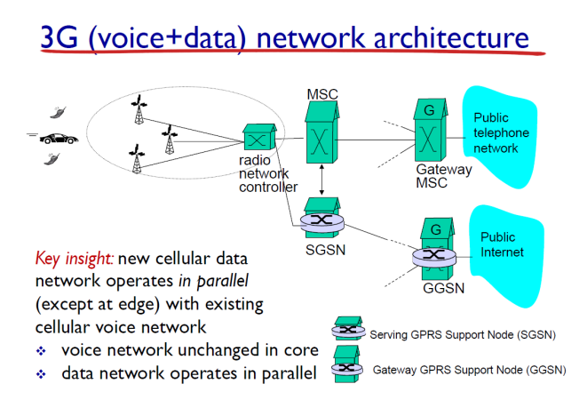

- 3G는 사용자 주변에 기지국과 관리 컨트롤러가 피라미드 구조로 있다.

