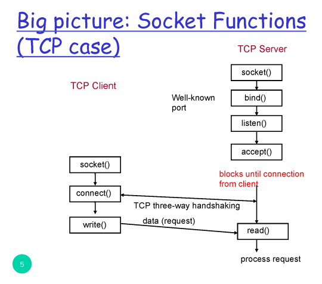
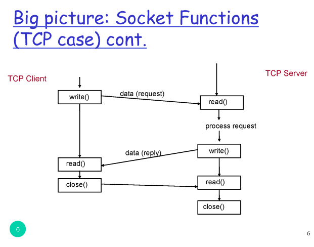
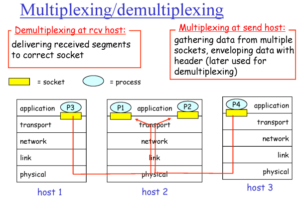
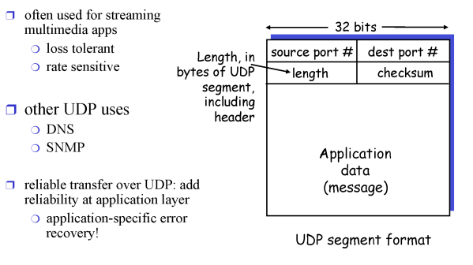
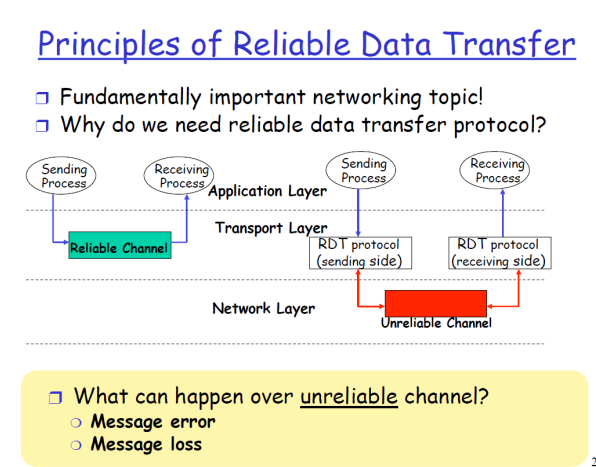
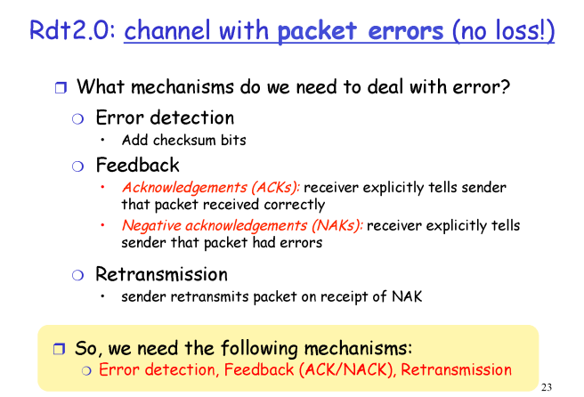
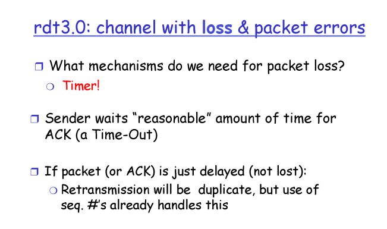
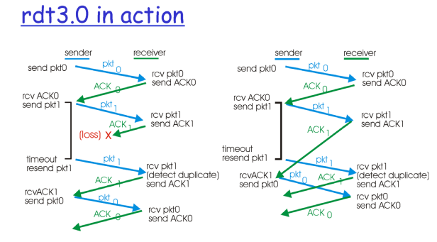
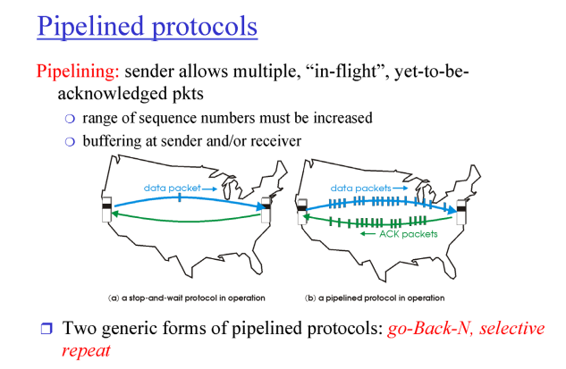

# 컴퓨터네트워크 3~4강

> 본 글은 KOCW 이석복 교수님의 강의를 정리한 기록입니다. 
> 강의와 자료는 무료로 공개되어 있습니다.
> (링크: http://www.kocw.net/home/m/search/kemView.do?kemId=1169634)

### 소켓이란?

1. [Server] 웹서버가 소켓을 연다.
2. 포트번호에 바인드 시킨다. 예를들면 80번
3. 서버기때문에 요청을 듣고있는다.
4. 이제 accept (준비) 되었다. 이 상태로 서버는 멈춰있는다.
5. [Client] 클라이언트가 소켓을 연다
6. 커넥션을 보내서 단단한 TCP 연결을 만든다.
7. 요청을 주고받는다.
8. 요청완료 후 종료 요청을 보내서 서로 합의하에 종료한다.

### Multiplexing / Demultiplexing

transport에서 하는 역할이다

- Multiplexing
  - 상위 layer에서 내려오는 여러개의 요청들을 처리해서 조각으로 만들어주는것
- Demultiplexing
  - 받은 조각에서 메시지만 꺼내서 정확한 process에 넣어주는것

### UDP 헤더

- UDP는 단순한 transport 프로토콜이다. 
- 해더는 4개로 구성되며, 여기서 하는 역할은 multiplexing, demultiplexing, 에러확인을 한다.
- TCP같은 경우에는 훨씬더 복잡하고 많은 역할을 한다.

### 전송 신뢰성

- 신뢰성이 없다는것은 페킷이 없어지거나 에러가 발생하는 경우이다.
- 어떤과정에서 에러가 발생할 수 있을지 생각해야한다.

#### 첫번째, 손실은 없으나 에러가 있는경우

- 에러가 있는지없는지 판단 (detection)
  - 에러가있다면 다시 보내달라고 요청해야한다.
- 즉, 잘 받았는지 에러를 받았는지 피드백을 준다.
  - 페킷을 받을때마다 피드백을 준다
- Sender는 피드백을 듣고서 잘받았으면 다음 정보를, 아니라면 다시 정보를 보낸다.
- 하지만 여기서 피드백에 에러가 있는경우는 문제가 생길 수 있다.
  - Reciver가 응답을 보냈지만 sender가 받지 못한 경우에 sender는 이전과 같은 메세지를 다시 보내준다.
  - Reciver의 경우에는 새로온 응답인지 아니면 다시 보낸 메시지인지 확인하기 위해서 해더를 확인하고 처리한다. 이는 헤더 페킷의 번호(sequence)를 통해서 알 수 있다.
    - 시퀀스 길이는 효율성을 위해 너무 과할 수 없다. sequence는 2개만 있으면 충분하다. 그래서 0,1을 돌려쓴다.

#### 두번째, 손실도 에러도 있는경우

- 손실이 발생하면 침묵이 흐르게된다. 즉, 어느정도 시간이 지나면 이를 손실이라고 볼 수 있다. 
  모든 페킷 전송에는 시간을 확인한다.
  - 시간은 얼마나가 좋을까? 너무 시간이 짧다면 네트워크에 무리를 많이 줄것이고, 시간이 길다면 캐치하는 속도가 느려서 서비스에 불리할것이다.

#### 전송과정

위와같은 과정으로 에러를 처리한다. 

### 파이프라인 전송

실제도 TCP는 위 방식으로 동작한다. 하나하나 확인하는것은 효율성이 좋지 않기때문에 적당한 규모로 한번에 보내고 받고하는 방법을 사용한다.
