# 컴퓨터네트워크 기본 5~8강

> 본 글은 KOCW 이석복 교수님의 강의를 정리한 기록입니다. 
> 강의와 자료는 무료로 공개되어 있습니다.
> (링크: http://www.kocw.net/home/m/search/kemView.do?kemId=1169634)

### Pipelined protocols

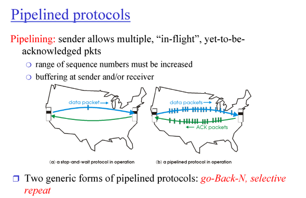

- 이전에 학습한 1번에 1개씩 페킷을 다루는 연결은 효율성이 떨어진다.
- 따라서 batch단위로 여러 페킷을 전송하고 확인하는 pipeline 방식을 사용하며, 이 방식의 프로톨을 학습한다.

#### Go-Back-N

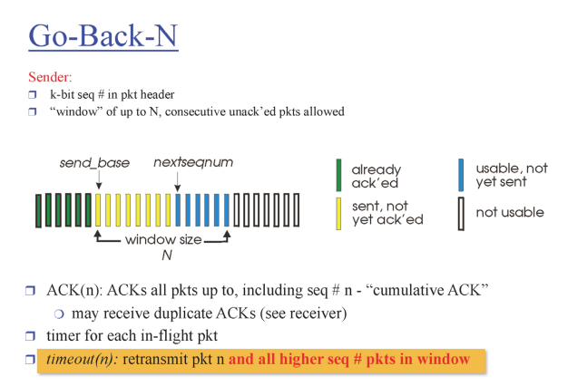

- 한번에 몇개를 보낼지 기준이 필요하다. 한번에 보내는 크기를 window size라고 한다.
- 여기서 AKC(n)은 n번까지 잘 받았다는 의미이다. 이 응답이 오면 sender는 n+1번부터 페킷을 송신하면 된다.
- 유실을 확인하기 위해 각각 페킷은 timer가 있다. 
- Reciver는 자신이 받아야할 페킷의 시퀀스만 기다리고 있는다. 다른게 오면 버리고 기다리고있는 ACK를 보낸다. 왜냐면 리시버는 저장공간이 없다.
- Sender는 ACK를 순차적으로 확인하면서 정상적으로 받은것을 앞에서부터 하나씩 지운다. 이렇게 window가 뒤로 밀려난다. 이제 오류가 난 시점부터 다시 완전한 window 페킷을 보낸다.

이러한 방식의 단점은 하나의 오류가 너무 큰 비효율을 만든다는것이다. reciver에 기능을 추가해서 효율성을 높여보자.

#### Selective Repeat

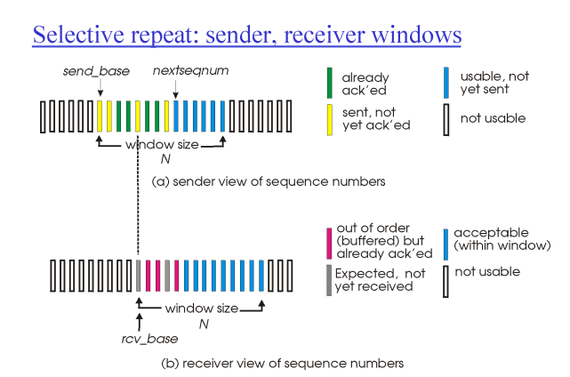

- 순서에 맞지 않더라도 페킷에 에러가 없으면 우선 저장한다. 그리고 받은 페킷에 ACK를 전달한다.

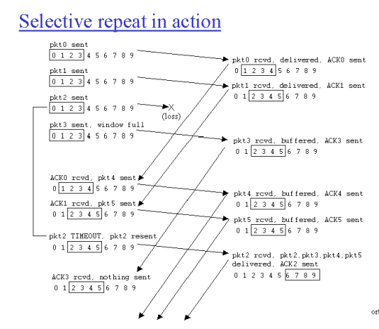

- Sender는 window를 보내면서 타이머를 기록한다
- Reciver는 받은 패킷을 실행하고 ACK를 돌려준다. 이때 원하는 순서로 오지 않는 이후 패킷은 buffer에 저장한다.
- Sender는 ACK가 오지않고 타임아웃이 발생한 패킷만 다시 보낸다. 
- Reciver가 알맞은 패킷이 다시오면 그것을 실행하고 버퍼에서 알맞은 것들을 순차적으로 실행한다.
- 결국, 오류만 재전송하기때문에 네트워크 효율이 좋다.
- 이렇게 하기 위해서 시퀀스는 window 사이즈의 최소 두배를 해야한다.

### TCP 개요

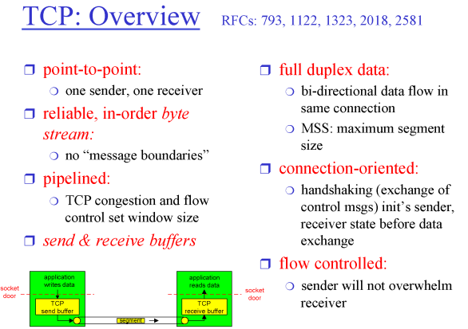

- 출발지부터 도착지까지 연결된다. Sender & Receiver는 각각의 포인트가 동시에 가지고있는 개념이다. 
  계속 양쪽의 역할이 바뀐다.
- 따라서 앞 개념에 따라 포인트 각각 sender buffer와 receiver buffer를 가지고 있어야한다. 

### TCP 분석

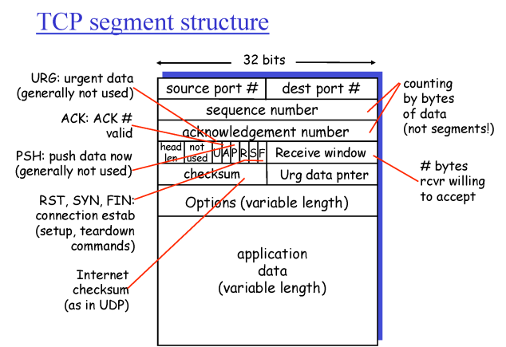

- TCP 해더는 총 32 bits이다. 따라서 각각 포트 번호는 16 bits (0~2^16-1 = 6만개 정도)이다.
- TCP에서 Sequence는 현재 주는 페킷의 순서 번호이다.
- TCP에서 Acknowledge는 요청하는 페킷의 번호이다. (go-back과 다르다!)
  ACK(20)이라면 19번까지 잘 받았으니 20번을 달라는 의미이다.
- TCP는 타이머 하나를 사용한다. go-back-N과 비슷하나, 타이머가 지나면 타겟 하나만 보낸다.
  - 타이머가 터지기 전에 유실을 판단 할 수 있다. receiver는 계속 필요한 패킷의 ACK를 보내기 때문에 특정 번호가 홍수가 난다면 그것을 유실되었다고 판단 한다. 즉, 같은 번호를 4번받으면 유실이라고 판단하고 보낼 수 있다. 이는 부가 기능이고, 타이머로만 작동시킬 수도 있다.

### Flow control

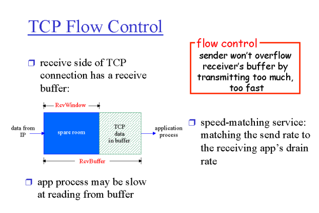

- Flow control은 상대방이 받을수 있는 규모의 데이터를 전달하겠다는 개념이다.
  각각 포인트는 send buffer와 receive buffer가 있다. 이것이 넘치지 않게 보내야한다.
- 요청에서 남아있는 buffer의 크기를 알려주어 문제를 해결한다.
- 공간이 완전 찼으면 남은 공간이 없다는것을 sender에다가 보낸다. sender는 그 이후에 가끔 아주작은 페킷을 보내서 남은 공간이 다시 생겼는지 모니터링한다.

### TCP 시작 과정

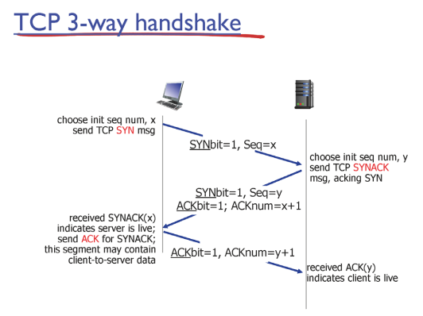

- SYN은 TCP를 연결하고싶다는 신호이다. TCP를 처음 열때는 1이고, 나머지는 0이다.
- 상대는 받아서 SYN ACK (1)를 응답한다. 
- 이후 sender는 SYN(0)을 주면서 데이터 전송(HTTP)이 일어난다.

### TCP 종료 과정

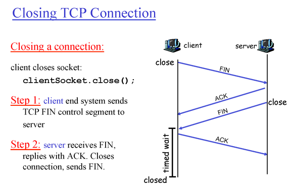

- FIN을 통해 종료를 요청하고, ACK+FIN을 날려서 종료응답 받았음을 확인시킨다.
- 이후 종료했음을 알리는 ACK를 보내고, timer가 끝날때까지는 buffer를 유지시켰다가 종료한다.
  그 이유는 server로부터 ACK를 받지 않기때문에, server가 받지 않았을때 다시 ACK+FIN이 오는지 확인하기 위해서이다.

### TCP 동작

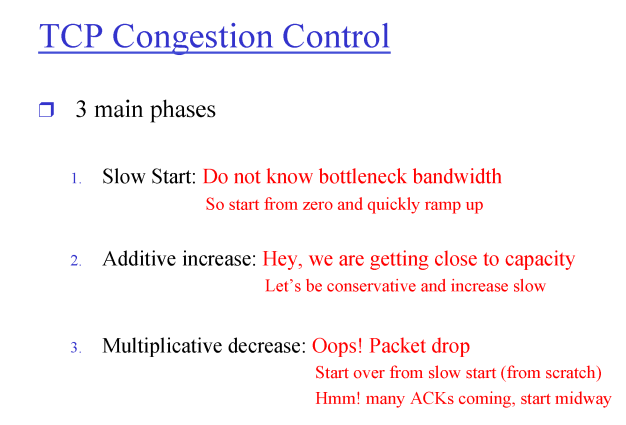

- TCP는 공용 네트워크를 사용한다. 이때 네트워크의 상태를 알 방법이 없다. 따라서 조십스럽게 조금씩 데이터를 보내어 네트워크 동작 상태를 추론한 다음에 많은 정보를 보내기 시작한다.
- Slow Start는 처음 시작시에 느리게 보내는 시작이다. 이 단계에서 점점 나가는 속도를 올린다.
  n배씩 지수함수로 증가한다.
- Additive increase는 이미 빠른 상태로 신나게 데이터를 보내고있다.
  이 상태에서는 선형으로 천천히 속도를 증가시킨다. 
- Multiplicative decrease는 네트워크가 막혔을때 모든 전송이 확 줄이기 시작하여 네트워크 환경을 회복한다.

### Tahoe vs. Reno

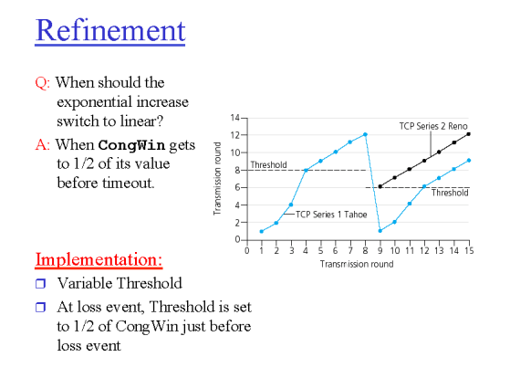

- Tahoe 가 첫번째 버전이고, Reno가 두번째 버전이다. 
- 효율적으로 속도를 제어하기 위해서 속도를 늘리고 줄이는 알고리즘을 변경하는 프로토콜이다.
- 처음에는 천천히 올리다가, 문제가 발생했을때 어디까지 줄이느냐가 핵심이고, Reno의 경우에는 더 적게 줄인다. 
- Timer 아웃으로 문제가 발생하면 네트워크 문제일 가능성이 높음으로 매우 속도를 줄이고, 3 duplicate ACK 경우는 해당 페킷만 문제가있을가능성이 높으므로 적게 속도를 줄이다.

### TCP 공평

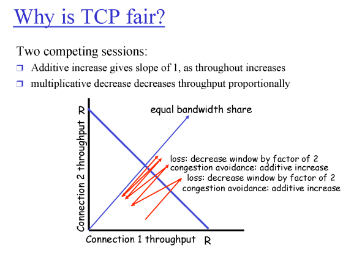

- 빨간색 화살표를 보면, 처음에는 속도 차이가 있더라도 두개의 TCP의 속도는 중간을 향해 나간다.
- 모든 TCP는 이렇게 같은 속도를 같게 향한다고 볼 수 있다. 하지만, TCP 커넥션을 더 많이 만드는 요청이 더 많은 양의 자원을 쓰게되는건 변함이 없다.
