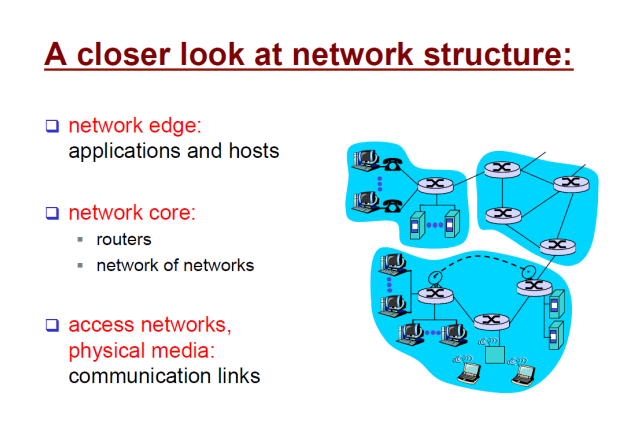
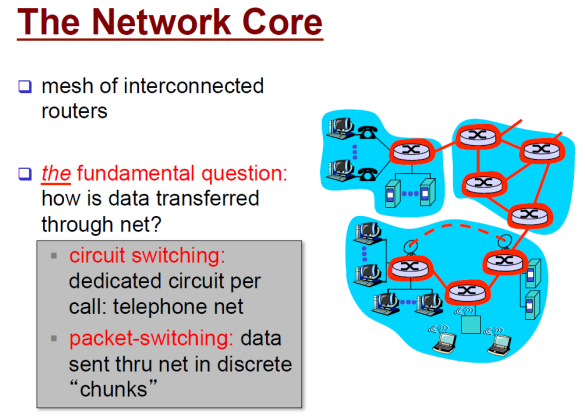
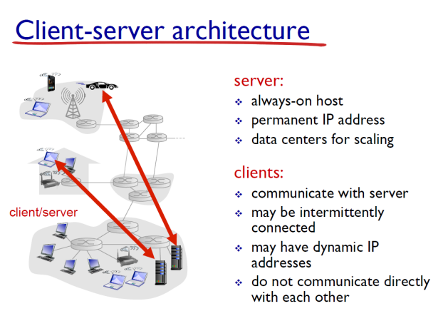
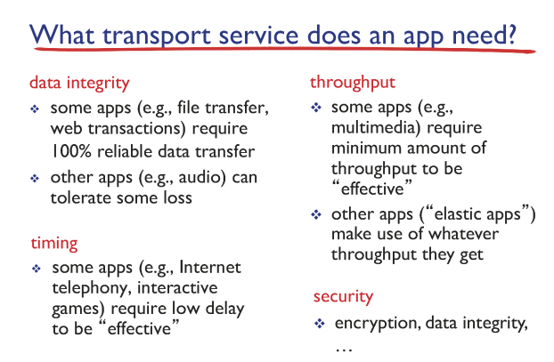
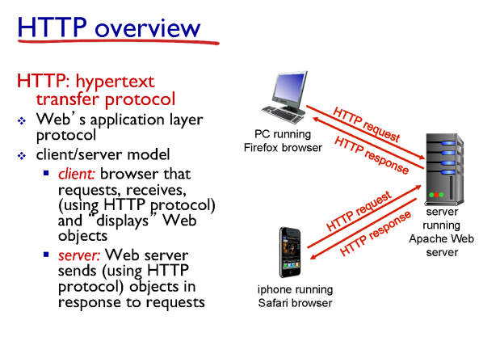

# 컴퓨터네트워크 기본 1~2강

> 본 글은 KOCW 이석복 교수님의 강의를 정리한 기록입니다. 
> 강의와 자료는 무료로 공개되어 있습니다.
> (링크: http://www.kocw.net/home/m/search/kemView.do?kemId=1169634)

## 네트워크는 구조

### 구조의 요소

구성요소만으로 인터넷을 봤을때는 위 3가지로 구분할 수 있다.

- edge
  - 우리가 가장 친근한 위치이다.
  - 네트워크에서 가장자리를 나타낸다.
- core
  - 라우터와 같이 네트워크를 연결하는데 필요한 장치들이다.
- media
  - 네트워크 연결을 말한다.
  - 유무선 링크로 연결되어있는 개념을 생각하면된다.

### 구조의 연결: 네트워크

- Connection-oriencted service (TCP)
  - TCP는 사용자에게 신뢰성, 순서보장을 제공한다. 
  - Flow control은 받는 서버(recevier)가 받을 수 있는 속도에 맞춰서 전달하는 개념이다. 
  - Congestion control은 네트워크 상태가 허용할 수 있는 용량만큼 데이터를 제공하는 개념이다.
- Connectionless service (UDP)
  - 정합성이 중요하지 않는 데이터는 UDP를 사용할 수 있다.
  - 상대방을 신경쓰지 않고 내가 원하는 속도로 보낸다는 개념이다.
  - TCP의 정합성이 필요하지 않을 경우 자원상 효과적일 수 있다. 하지만 도착한다는 보장이 적다.

- 프로토콜
  - 기본적으로 같은 언어와 같은 방식을 가져야 이야기가 가능하다. 
  - 네트워크에서 이를 프로토콜이라고 생각하자.

### 네트워크 코어

- Circuit switching
  - 목적지까지 가는길을 미리 예약해두고 특정 사용자가 그 길을 가도록 하는 방법
  - 유선 전화망에서 사용했음.
  - 자원의 총량이 정해져있고, 그 제한 안에서만 사용가능하다.
- Packet switching
  - 전하는 메세지를 페킷이라는 단위로 계속 흘려 보내는 방법
  - 인터넷에서 데이터를 주고받을때 사용하는 방법
  - 자원 제한이 없다. 하지만 사용자가 몰리면 문제가 발생 할 수도 있을것이다.
  - 이렇게 packet 요청이 나가는 요청보다 더 많아지면 router의 buffer(queue)에 저장하여 관리한다. 여기서 머물면서 발생하는 delay를 queueing delay라고 한다.
    - 여기서 발생하는 delay는 사용자에 따라서 관련된다. 따라서 가장 다루기 어렵다.
    - 이를 늘리기 위해서는 병렬로 router를 만들어 밸런싱해야한다.
    - 인터넷에서 발생하는 페킷 유실은 여기 queue를 넘쳐서 발생한다.
  - Packet이 router queue에서 출발해서 광케이블에 올라가는 속도를 Transmission delay라고 한다. 이는 bit로 이루어진 페킷 길이가 짧을수록 & 한번에 올라갈수 있는 범위가 클수록 빠르다.
    - 이 delay를 줄이기 위해서 router 성능을 개선 할 수 있다. 
    - 케이블 공사를 통해 bandwidth 길이를 늘릴 수 있다.
  - Packet이 queue에서 완전히 나온 순간부터 다음 라우터까지 가는 시간은 빛의 속도이다. 이를 propagation delay라고 한다.

### Client-server 구조

- 서버
  - 서버는 고유한 IP 주소를 가져야한다. 사람들이 찾아가기 위함이다.
  - IP주소는 어떤 컴퓨터인지 나타낸다면, port는 같은 컴퓨터에서 여러개의 프로세스가 돌고있는데 어떤 프로세스인지를 나타낸다고 보면 된다. 
- 클라이언트
  - IP주소가 고정되지 않아도 된다.

### 데이터 전달 요구 사항

- Data integrity
  - 보낸 데이터가 유실되지 않고 목적지에 도착해야한다.
  - 현재 Application layer에서는 이것만 고려해서 제공한다. (TCP)
- Throughput
  - 보내는 데이터가 어느정도 용량이 가능했으면 좋겠다.
- Timing
  - 보낸 데이터가 n초 이내에 도착했으면좋겠다.
- Security
  - 보낸 데이터가 외부로부터 안전하게 전달되었으면 좋겠다.

### HTTP

- 이름 의미: 하이퍼텍스트를 전달하는 프로토콜이다. 
  - 하이퍼 텍스트는 결국 텍스트인데, 중간중간 태그가 있다는 의미이다.
- HTTP는 영속성을 가지지 않는다. 즉, 한번 전달하고 잊어버린다.
  하지만 데이터를 주고받는 순간에는 영속성 상태이다.
  - TCP요청을 통해 클라이언트와 서버가 연결되고, 모든 요청을 처리한 다음에 연결을 끊어버린다. 
    이러한 상태를 비영속성이라고한다. 
  - 

