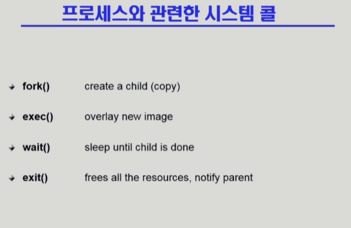
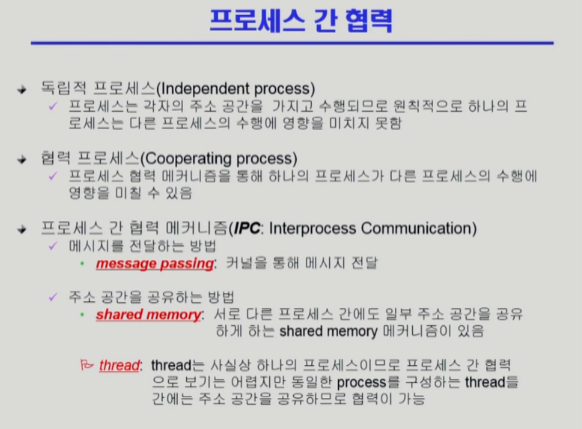
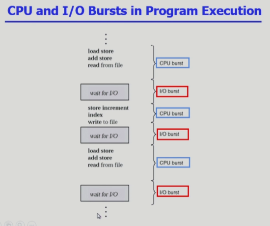
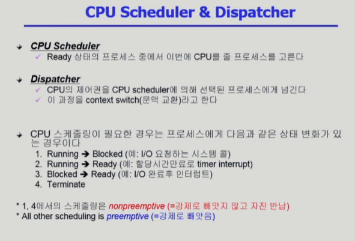
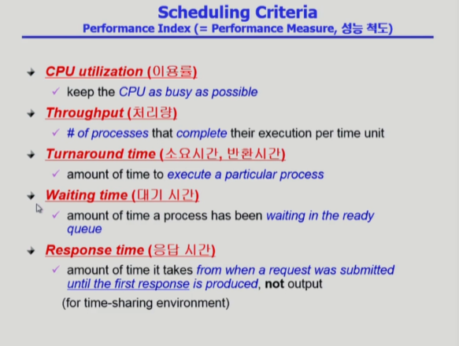
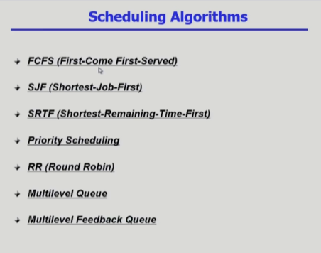

# 운영체제 4강

> 본 글은 KOCW 반효경 교수님의 강의를 정리한 기록입니다. 
> 강의는 무료로 공개되어 있습니다.
> (링크: http://www.kocw.net/home/m/search/kemView.do?kemId=1226304)

- fork
  - 프로세스는 복제를 통해서만 새로 생성이 가능하다. 이렇게 복제하는 방법을 fork라고 한다. 복제 이후 같은 코드라인에서 로직이 수행됩니다.
  - 복제되면 자식과 부모로 구성되며 부모,자식은 fork의 결과값인 pid를 통해서 확인가능하다.
- exec
  - 위와 비슷하게 한 프로세스가 다른 프로세스를 실행시키기 위한 함수이다.
  - 차이점은 복사가 아니라 덮어쓰기와 유사하게 구현됩니다. 즉, exec에 의해 호출된 프로세스가 메모리에 남게됩니다.
- wait
  - 자녀 프로세스가 종료될때 까지 부모 프로세스를 슬립(brock)시킵니다.
  - 예를들면 리눅스에서 Vim을 사용할때, 명령창이 넘겨지면서 자녀 프로세스 모드가 실행되고, 이전에 명령 커멘드는 슬립된다.
- exit
  - 프로세스를 종료시킨다. exit으로 종료되는것은 자발적 종료이며, 부모 프로세스에 의해 종료되거나 키보드로 종료되는 비자발적 종료 방식이 있다.
  - 모든 자원을 반납하고, 부모 프로세스에게 종료를 알린 다음 종료한다.

- 일반적으로 프로세스는 독립적이다. 다른 프로세스의 메모리 공간을 참조할 수 없다.
- 경우에 따라서 프로세스에 협력이 가능하도록 코딩할 수 있다. IPC를 통해서 협력한다.
  - 메시지 전달 방식
    - 프로세스 A가 프로세스 B에게 메시지를 전달하는 방식이다.
    - 메시지는 직접 보낼 수 없고, 운영체제(kernel)가 전달한다.
  - 주소 공간 공유 방식
    - 신뢰할수 있는 두 프로세스라는 가정하에, 프로세스가 메모리 공간을 받을 때 공유되는 메모리 공간을 배정받는것이다.
    - 이러한 배정은 os를 통해서 진행된다.

### 프로세스 일생

- 프로세스 일생은 CPU에서 실행하는 작업과 I/O를 하는 작업으로 구분할 수 있다.
- CPU를 잡았을때는 매우 빠르게 실행되다가, I/O를 잡으면 느려지고 프로세스 실행을 빼앗기고 기다리거나 하기도한다.
- 이러한 구성은 프로그램마다 다르며, 사람과 인터렉션이 많은 프로그램은 I/O가 많다.

- 스케줄러와 디스페처는 소프트웨어이다. OS 일부라고 볼 수 있다.
- 스케줄러는 CPU를 누구에게 줄지 결정한다.
- 디스페처는 스케줄러를 통해 결정된 프로세스에게 CPU를 넘기는 역할을 수행한다.
  - CPU를 빼앗기는 프로세스를 저장하고, 새로운 프로세스에 CPU를 주는 문맥교환을 수행한다.
  - CPU를 얻는 과정은 ready queue에 있던 프로세스가 Running으로 넘어가는 과정이다.
  - CPU를 뺏기는 과정은 위 그림 내용에 상황과 같다.

### CPU 스케줄링 성능 척도

- 크게 이용률, 처리량, 시간 3가지 항목으로 구분한다.
  - 이용률이 많을수록, 처리량이 많은수록, 시간이 짧을수록 좋은 방법이다.
- 이러한 성능 척도를 가지고 어떤 알고리즘을 선택할지 결정한다.

### CPU 스케줄링 알고리즘

- FCFS (First-Come First-Served)
  - 선착순으로 먼저온 프로세스부터 CPU를 할당하고, 종료까지 건들지 않겠다.
  - 문제: convoy effect (긴 프로세스로 인해 짧은 프로세스가 손해받음)
- SJF (Shortest-Job-First)
  - CPU를 가장 짧게 쓰려는 프로세스에게 CPU를 할당한다. 
  - 중간에 CPU를 뺐는 방법과 CPU를 뺐지 않는 방법으로 구분 한다. 
    - Nonpreemptive: 일단 CPU를 잡으면 끝날때까지 냅둔다.
    - Preemptive: 지금 수행하는 프로세스 남은 시간보다 더 짧은 시간의 프로세스가 들어오면 뺐어서 더 짧은 프로세스에게 준다. 이를 **SRTF**라고 부른다. 새로운 프로세스가 도착할때마다 어떤 프로세를 돌리는게 좋을지 계산해서 수행시킨다.
  - 대기 시간 측면에서 가장 좋은 방법이다.
  - 문제: Starvation (기아)를 발생한다. 긴 프로세스의 경우 영원히 job을 얻지 못한다.
  - 문제: 누가 짧게 쓸지 보장할 수 없다. 짧게 쓴다고 해서 CPU를 줬는데 길게 쓸 수 있고, 길게 쓸 줄 알았는데 짧게 끝날수도 있다..
- Priority Scheduling
  - 우선순위가 높은 프로세스에게 우선 순위를 주겠다.
  - SJF 역시 priority scheduling의 일종이다. 우선순위를 시간으로 사용한다.
  - 문제: Starvation이 가능하다.
  - 해결: Aging 개념을 사용할 수 있다. 기다릴 수록 우선순위를 높여주는 방법이다.
- Round Robin
  - 현대 CPU 스케줄러의 근간이 되는 방법이다. Timer 개념이 사용된다.
  - 프로세스가 CPU를 얻을때는 동일한 할당 시간을 부여받는다. (10~100 ms 정도)
    - I/O bound job의 경우에는 충분히 시간만큼 사용된후 내보내고, CPU bound job의 경우에는 할당 시간만큼만 사용시키고 내보내는것을 적당하게 본다.
  - Response time을 가장 짧게 하는 방법이다.
- Multilevel Queue
  - Ready queue를 분할한다.
    - Foreground (interactive)
    - Background (batch)
  - 각 큐에는 독립적인 스케줄링을 준다
    - Foreground (interactive) -> RR
    - Background (batch) -> FCFS (기아 방지를 위해 다른걸 쓸 수도있다.)
  - Interactive한 job들이 CPU를 더 많이 얻게하는 방법이다. Background는 쭉 CPU를 사용한다고 생각하고, 적당히 CPU를 길게 부여하는 방법이다.
  - 각 해당되는 큐에 프로세스가 속하면 다른 종류의 큐는 갈 수  없다.
- Multilevel Feedback Queue
  - 앞서 방식에서 각 큐를 이동하는 기능을 추가한 알고리즘이다.
  - Aging 등의 요소를 사용해서 우선순위가 높은 큐로 보낸다.

