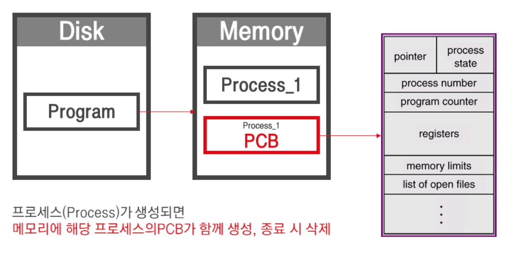

# Context switching

## Context switching이란

여러개의 프로세스가 실행되고 있을때 기존에 실행되는 프로세스를 중단하고 다른 프로세스를 실행하는것이다. 즉, CPU를 사용하는 프로세스를 교체하는 방법이다.

## Process Context(Control) Block

실행 종료 전에 Process 상태를 저장한다. 현재 상태를 나타내는 스탭샷이라고 이해할 수 있다. PCB는 특정 프로세스를 관리하는 모든 정보를 가진다. 자료 구조라고 보면 되고, 운영체제 내부에 보호된 메모리 영역에 저장한다. 프로세스가 생성될때 고유한 PCB가 생성되어 프로세스가 완료되면 제거한다.

- ID: 프로세스 식별자
- State: 프로세스 상태 (create, ready, running, waiting, terminated)
- Program counter
- register

## Context switching 작동 순서

프로세스1이 running이고, 프로세스2가 ready 상태

1. 스케줄러가 프로세스1의 중단을 알리고 프로세스2 실행을 요청함
2. 프로세스1에서 Stack의 위치(SP)와 다음 실행해야하는 코드의 주소값(PC)을 PCB에 저장함. SP: stack pointer, PC: program counter
3. 프로세스1은 ready 또는 block 상태로 바뀌고, CPU에서 프로세스2가 실행됨. 이 과정에서 프로세스2의 state가 ready에서 running으로 변경(dispatch)됨

## Context switching 발생 상황

- I/O interrupt
- CPU 사용 시간 만료
- 자식 프로세스 Fork
- Interrupt 대기

위 상황에서 우선순위에 따라 프로세스가 교환된다. 우선순위를 정하는 방법은 다양하나, 현대 OS는 라운드로빈 방식을 사용한다.

프로세스가 들어온 순서대로 Time Quantum을 할당하여 할당된 시간만큼만 프로세스를 실행시키고 다음 프로세스를 진행하겠다는 의미이다.
