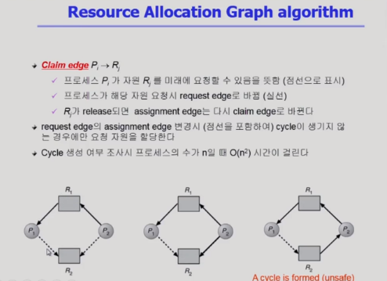
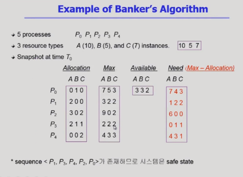
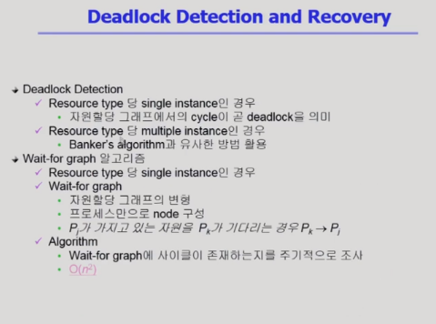
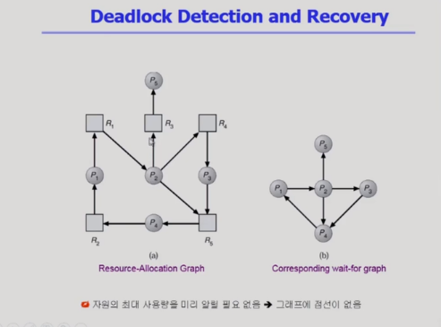
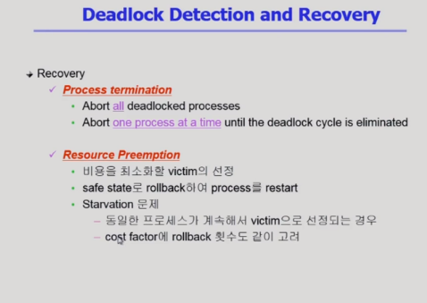

# 운영체제 7강

> 본 글은 KOCW 반효경 교수님의 강의를 정리한 기록입니다. 
> 강의는 무료로 공개되어 있습니다.
> (링크: http://www.kocw.net/home/m/search/kemView.do?kemId=1226304)

### Resource Allocation Graph Algorithm

- 계속해서 데드락을 방지할수 있는 방법을 학습한다. 
- 아래 그림에서 원은 프로세스를 사각형은 자원을 나타낸다. 
- 직선은 자원을 요청하는것이고, 점선은 프로세스가 평생에 한번은 요청한다는 의미이다.
- 이 자원에 누가 관심이 있는지 미리 예측할 수 있다.
- 아래 그림에서 모든 점선이 실선이 된다면 사이클이 발생해서 데드락이 발생한다.
- 따라서 사이클이 발생할 가능성이 없을때 자원을 할당한다.

### Banker's Algorithm

- 자원에 인스턴스가 여러개일 경우에 Banker's 알고리즘을 사용한다.
- 테이블을 만들어서 자원을 할당할지 안할지 결정한다.
- 위 예시에서 A 10개 B 5개 C 7개 자원이 있다.
- 프로세스에 어떤 자원이 할당되었는지 Allocation 표에서 볼수있다.
- Max는 프로세스가 평생에 최대로 쓸수있는 자원이다.
- Need는 Max - Allocation으로 추가로 요청할 양이다.
- Available은 가용자원이다.
- 자원을 배분할때 자원 요청할 가능성이 높다면 가용자원을 줄수있는 상황에서도 주지 않는다.
  - 여기서 P0는 자원을 못받을 수 있을 위험이 있어서 할당하지 않는다.
  - P1은 자원을 주었을때 충분히 프로세스가 돌아가므로 자원을 준다. (가용자원이 부족할때까지 요청하지 않는다는 보장이 있다.)

### Deadlock Detection and recovery

- 데드락 발생은 허용하되, detection루틴을 두어 데드락을 해소한다.
- 자원이 싱글일 경우에 그래프를 이용하고, 자원이 여러개일 경우 Banker's 알고리즘을 이용한다.

- 자원의 인스턴스가 하나만 있는 경우는 오른쪽처럼 자원을빼고 그릴 수 있다.
- 위 그림은 데드락이 생기는 경우이다. 데드락을 감지할 수 있다.

- 데드락 상황에서는 어떤 프로세스가 희생적으로 종료되어야한다. 그러한 프로세스를 찾는것이 회복에 중요한 개념이다.
- 희생 프로세스를 찾아서 자원을 빼앗고, 다시 실행할때 그 프로세스가 또 가져가지 않겠금 해야한다.

- 현대 OS는 데드락을 무시하고, 어떤 일도 하지 않는다.
- 데드락은 매우 드문 현상이다. 따라서 이를 처리하는것이 낭비일 수 있다. 
- 데드락이 발생할때 사용자가 해결하도록 한다.

