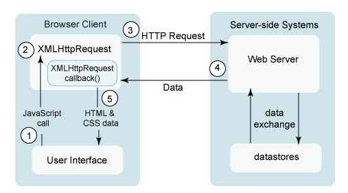

# 동기와 비동기의 차이(블로킹, 넌블로킹)

## 동기 / 비동기

동기 비동기는 요청에 대한 응답을 기다렸다가 다음것을 수행하는지, 아니면 요청 후 응답을 기다리지 않고 일을 수행하는지 관련이 있다.

동기 방식은 요청후에 응답을 대기하다가 응답이 오면 다음 동작을 수행한다. 비동기는 응답과 상관없이 다음 동작을 수행한다.

### 사용 장단점

동기는 작업순서를 보장합니다. 따라서 이전 작업이 선행되어야 하는 경우에 동기적인 방식으로 진행해야합니다. Transaction으로 작업이 묶여서 이전 작업이 실패했을 경우 다음 작업을 실행하지 않는 경우에 사용할 수 있습니다.

비동기일 경우에는 응답을 기다리지 않기때문에 응답 지연이 발생하더라도 프로그램 속도에 영향을 크게 주지 않습니다. 다만 코드 구현이 복잡하고, 응답이 오기전에 다른 동작들이 수행되는것을 고려해서 코드를 작성해야 합니다.

### AJAX

비동기의 가장 대표적인 예시이다. HTML을 그릴때 비동기 방식으로 필요한 요소만 서버로부터 불러오는 방법이다. 기존의 HTML는 그대로 유지한체, 서버에서 응답이 오면 다시 HTML을 추가해 그려주면 되는 대표적인 비동기 예시이다.

이 방법을 통해 페이지 전체가 아닌 필요한 일부분의 변경으로 사용자 경험을 높이고, 서버에 대한 부담을 줄일 수 있다.

## 블로킹 / 넌블로킹

블로킹은 위에 동기 비동기와 어느정도 연관이 있습니다. 동기 상태에서 다음 로직을 수행하기 위해 응답을 기다리는것은 결국에 코드 흐름을 블로킹하는 과정입니다.

비동기 상태로 응답에 상관없다면 이는 논블로킹이라고 말할 수 있습니다.
