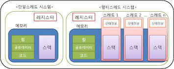

# 멀티스레드 프로그래밍

## 프로세스와 스레드 관계

프로세스는 최소 하나 이상의 스레드를 가집니다. 멀티스레드 프로세스는 여러개의 스레드를 가지고있습니다.

스레드는 다른 스레드를 통해서 생성됩니다. 스레드는 자신의 Stack을 가지고, Data, Heap, Code 영역을 공유합니다. 이러한 스레드는 하드웨어적으로 관리됩니다.

## 멀티 스레드 장단점

장점

- 프로세스 생성보다 Thread 생성이 자원 효율적이다.
- Context switch overhead가 적다
- Thread간 통신은 간단하다.

단점

- 하나의 Thread에 문제가 발생하면 프로세스 전체에 영향을 준다.
- 디버깅이 복잡하다.

## 사용 예시 (Web)

서버 프로그램을 띄우게 되면 여러 클라이언트가 접근합니다. 클라이언트가 소켓을 통해 접근하면 서버는 하나의 스레드를 넘겨줍니다. 여러개의 요청이 들어오면 스레드가 많이 생성되어 멀티 스레드 환경이 됩니다. 따라서 웹 서버를 개발할 때 스레드간 공유되는 데이터가 안전하도록 thread-safe하게 개발해야 합니다.

## Java Thread

JVM을 사용하면 여러 쓰레드를 생성할 수 있다. 쓰레드는 우선순위를 가지며, 이는 실행 순서에 영향을 준다. 데몬 쓰레드는 다른 쓰레드에 접근할 수 있으며, Garbage collector가 대표적이다.
