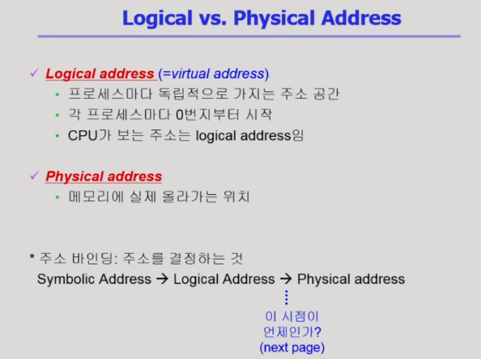
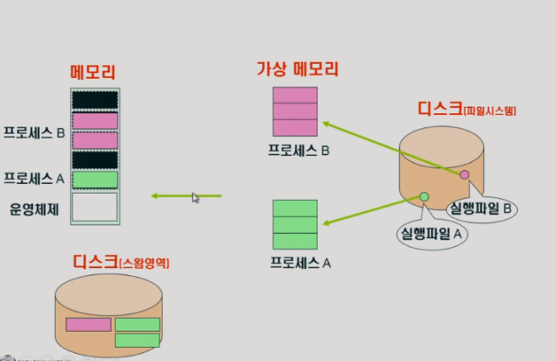
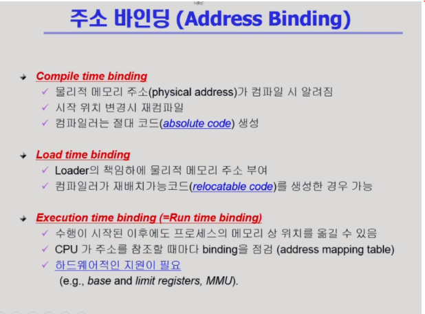
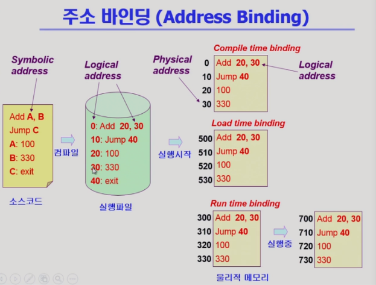
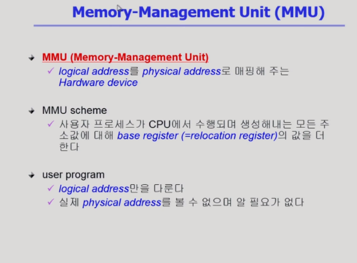
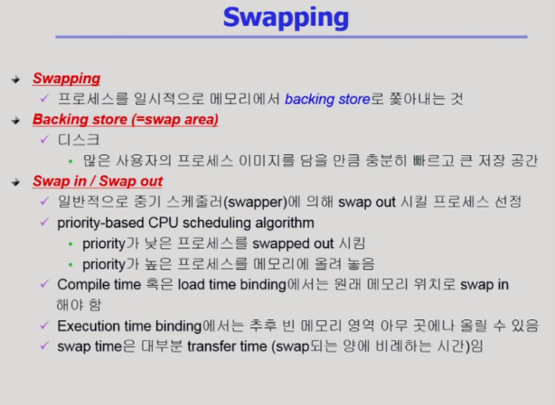
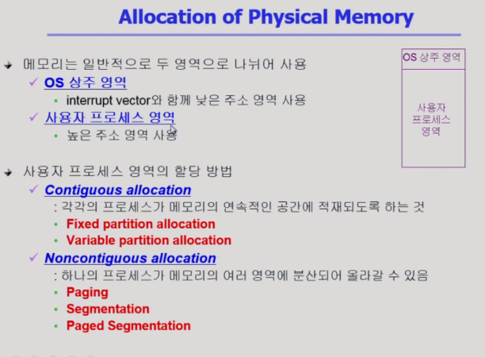

# 운영체제 8강

> 본 글은 KOCW 반효경 교수님의 강의를 정리한 기록입니다. 
> 강의는 무료로 공개되어 있습니다.
> (링크: http://www.kocw.net/home/m/search/kemView.do?kemId=1226304)

### 메모리란

- 메모리는 주소를 통해 접근할 수 있다. 주소는 논리적/물리적으로 구분한다.

- 현대 OS에서는 이렇게 가상주소와 물리적인 주소가 복합적으로 사용한다.
- 개발자가 코딩을 할때는 변수를 선언해서 값을 할당하는데, 여기서 누군가가 변수에 주소를 부여하게 된다. 이는 하드웨어가 담당한다.

- 논리적인 주소를 물리적으로 할당하는것을 주소 바인딩이라고 한다.

- 왼쪽 그림과같이 코드를 작성한다고 하자.
- 코드가 실행파일로 컴파일되면서 심볼은 숫자로된 논리 주소로 변환된다. 이때 complie time binding이라면 물리적인 주소가 하드웨어를 통해서 결정된다.
  - 실행파일이 실해되서 프로세스로 올라가면 바로 물리적인 주소를 이용할 수 있다. 
- 여기서 배정된 물리적인 주소가 실제 OS를 통해 할당받는 공간이 아닐 가능성이 높다. 따라서 현대에서는 Load time, run time binding을 배정받아서 사용한다.
- run time binding은 실행되는 시점에서 물리적인 주소가 변경될 수 있다. 결국 OS는 프로세스를 실행할때 논리적인 주소를 읽어가면서 지속적으로 물리적인 주소를 찾는다.

- 하드웨어가 물리적인 주소를 찾는 방법을 MMU라고 한다.
- 사용하는 메모리가 전부 올라간다고 가정하면, relocation register가 어디서부터 시작하는지 시점만을 찾아서 논리적 주소를 더하는 개념으로 공간을 찾을 수 있다. 
- 하지만 현대 OS는 전체가 메모리에 올라가지 않고 디스크에 swap영역을 만들어서 필요한 공간만 메모리에 올리면서 사용한다.  

### Swapping

- 메모리에서 디스크로 공간을 빼는것을 말한다.
  - 디스크에 메모리 내용을 복사하고, 메모리 공간을 비운다는것을 의미한다.
- 초기에 swapping을 프로세스 전체를 메모리에서 디스크로 보내는걸 말한다.
  - 중기 스케줄러를 통해서 관리한다.
  - cpu에서 실행될 가능성이 낮은 프로세르를 out시킨다.
- 현대적 OS는 부분을 페이징 기법으로 디스크로 보낸다.

### 물리 메모리 관리

- 물리 메모리를 관리하는 방법을 크게 2개로 나눈다
- Contiguous allocation
  - 연속 할당 방식
  - 메모리를 쪼개지 않고 전체가 올라가거나 내려가거나 하는 방식이다.
  - 물리 주소를 찾을때 연속적으로 프로세스가 있기때문에 시작위치를 더해서 물리 위치를 찾을 수 있다.
- Noncontiguous allocation
  - 불연속 할당 방식
  - 여러개로 프로세스가 잘려서 메모리에 산발적으로 올라갈 수 있고, 일부만 올라갈 수 있다.
- 어느 공간을 배정할지는 중요한 문제이다. 
  - First-fit
    - 공간 차지가 가능한 공간을 발견하면 바로 배정한다.
    - 시간 효율이 높다
  - Best-fit
    - Size가 가장 작으면서 공간 차지가 가능한 공간을 배정한다.
    - 전체를 탐색해야 한다는 단점이 있으나 공간 효율이 좋다.
  - Compaction
    - 여러 공간 조각을 모아서 적절한 크기의 공간을 만들어 배정한다.
    - 다른 메모리를 이동시키기 때문에 비용이 많이 든다.
    - 적절한 이동 방법을 결정해야 하기때문에 복잡한 알고리즘이 수행된다.

