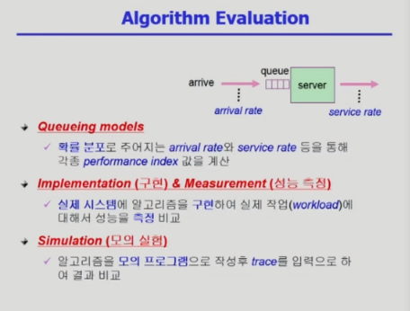
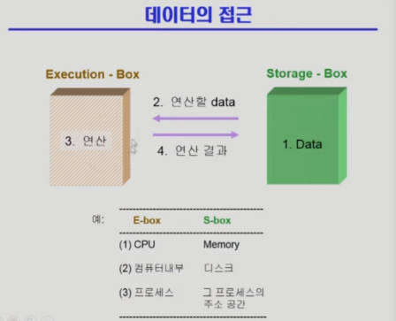
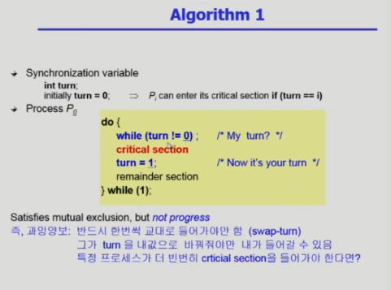
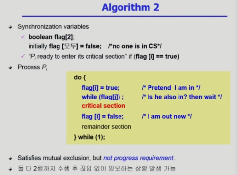
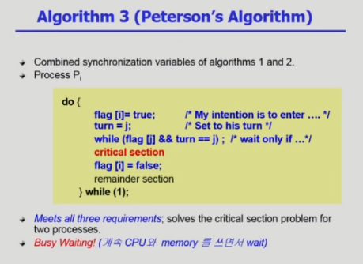
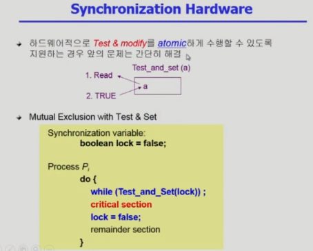
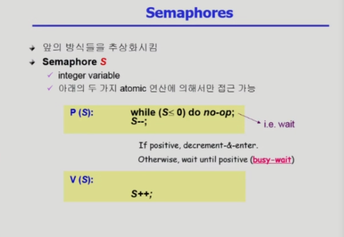
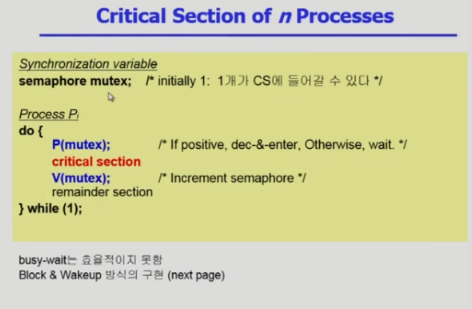
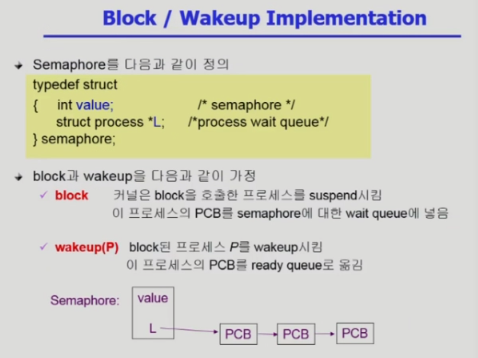
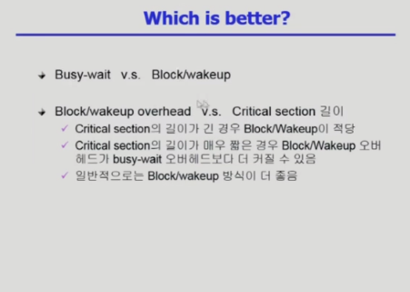

# 운영체제 5강

> 본 글은 KOCW 반효경 교수님의 강의를 정리한 기록입니다. 
> 강의는 무료로 공개되어 있습니다.
> (링크: http://www.kocw.net/home/m/search/kemView.do?kemId=1226304)

- 효율적인 프로세스 처리를 위해서 배정을 잘하는것이 중요하다. OS에서 배정해주지만, 프로그램이 직접 원하는 CPU를 선택하게 만들수도 있다.
- 여러 CPU가 골고루 일하게 하는 방법이 Load sharing이다.
  - CPU마다 큐를 만들 수 있고, 공통 큐를만들어서 빈 CPU에 배정할 수 있다.

### 성능 평가 지표

- Queueing models
  - 이론적인 모델로 게산을 통해서 결과값을 찾는다.
  - CPU를 원하는 프로그램이 큐에 도착하는데, 이는 확률 분포로 주어진다. 통계적 계산을 통해 처리량, 대기시간 등을 구한다. 
- 구현 & 성능측정
  - 직접 프로그램을 구현해서 성능 측정한다. 실험적 방법이다.
  - 리눅스에서 공개된 CPU 코드를 기반으로 프로그램을 만든다.
- 모의 실험
  - 실제 시스템을 구현하지는 않지만, 가상적인 프로그램으로 구현하는 방법이다.
  - 리눅스 CPU를 개발하기 어렵기 때문에 대안으로 사용한다.

### 데이터 접근

- 프로세스는 저장된 데이터를 읽어서 연산하고 다시 데이터를 저장한다.
- 여기서 서로다른 연산 주체가 같은 데이터에 접근해서 쓰기를 하는경우에는 문제가 발생할 수 있다. 이러한 경쟁 관계를 race condition이라고 부른다.
- 프로세스의 저장공간은 분리되어있는데 어떻게 이런 경우가 발생할까?
  - 프로세스는 직접 할수 없는 경우에 OS system call을 통해서 운영체제에 일을 부탁한다.
  - OS가 어떤 일을 처리하다가 프로세스가 변경되었고, 새로운 프로세스가 또 system call을 하는경우 프로세스는 다르나 같은 저장공간을 사용하는 일이 발생한다.
  - 이러한 문제를 해결하기위해 OS가 일하는 커널 모드에서는 프로세스를 교환하지 않고, system call이 끝나면 프로세스를 교환하게 한다.
- CPU가 여러개가 하나의 프로세스를 처리한다면 같은 문제가 발생할 수 있다. 
  - 이 경우에는 critical section이 어디인지 정확하게 알아야한다. 이는 코드 영역이다. 
  - critical section에 접근할때는 락을 사용해서 다른 cpu가 접근하지 못하게 해야한다.

### 락 알고리즘

- turn이라는 동기화 변수를 공통적으로 사용한다. 만약 turn이 1이라면 들어가지 않고, turn이 0이라면 들어가는 방식이다. turn을 다 사용하고 상대방의 turn인 1로 바꾼다.
- 이 방법은 동시에 들어가는 문제는 방지할 수 잇다. 하지만, 아무도 critical section에 없는데 아무도 접근할 수 없는 문제가 발생 가능하다.
- 상호배타적으로 들어갈 수 있으나, 하나의 프로세스가 무한으로 돈다면 영원히 들어가지 못하는 문제가 발생한다.
- 새로운 프로세스가 생성되었을때 턴에 배정받지 않으면 들어가지 못하는 문제가 발생한다.

- 프로그램마다 flag을 가지고있는다. 들어가고 싶을때 자신의 flag를 킨다.
- 상대방의 깃발이 하나도 없으면 들어간다.
- 프로세스를 종료하면 flag를 꺼준다.
- 이 방법은 동시에 들어가는 문제는 방지할 수 잇다. 하지만, 아무도 critical section에 없는데 아무도 접근할 수 없는 문제가 발생 가능하다.

- 주로 사용되는 대표적인 알고리즘이다.
- 위 알고리즘을 둘다 사용한다. turn과 flag가 있다.
- Busy waiting (spin lock): CPU를 차지하면서 계속 while문만 돌면서 자원을 낭비하는 현상이다.

### 락 하드웨어 방법

- 하드웨어적 방법으로 원자성을 만든다. 
- 값을 읽는 동시에 변경해서 다른 cpu가 쓰고있다는것을 보여준다.

### 세마포 (Semaphores)

- 추상 자료형이다. 구체적으로 정의된것은 아니다. 표현이랑은 관계없다.
  S는 하드웨어적인 방법으로 정의한다.
- P는 자원을 획득하는 과정이고, V연산은 자원을 반납하는 과정이다
- S는 자원의 수를 나타낸다.

- 들어갈때 P연산을 하고, 나올때 V연산은 하게 코딩한다.
- 여기서 busy waiting문제를 해결하기 위해선, cpu를 반납하고 blocked 상태로 들어가는것이 좋다. 

- 세마포에 따라서 값과 리스트 구조로 만들 수 있다.
- 세모포 여분이 없어서 프로세스가 기다릴때, 링크를 걸어서 줄세우고 block 상태로 만든다.
- 프로세스가 종료되고 자원이 생길때 링크를 통해서 프로세스를 깨워서 돌린다. (sleep lock)

- 어떤 방식이 좋은지 평가할 필요가있다. 일반적으로 block/wakeup이 좋다.
- 하지만, block/wakeup 역시 알고리즘이 수행되는 연산이다. 경쟁이 매우 적게 발생한다면 busy-wait를 선택할 수 있다.

