# 운영체제 6강

> 본 글은 KOCW 반효경 교수님의 강의를 정리한 기록입니다. 
> 강의는 무료로 공개되어 있습니다.
> (링크: http://www.kocw.net/home/m/search/kemView.do?kemId=1226304)

### 동기화 문제 1

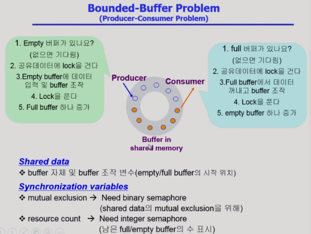

- 동기화에서 발생할수 있는 문제 중 Bounded-buffer 문제가 있다
- 여기서 생산자 프로세는 공유 버퍼(이미지 주황색)를 만들어서 넣어주고, 소비자는 꺼내서 사용한다.
- 공유 버퍼에는 각자 프로세스가 사용하는 데이터가 들어있다. 따라서 공유 버퍼를 만드는 과정이나 사용하는 과정에서 락을 걸고 처리해서 중간에 CPU가 교체될때 에러가 발생하지 않게 해야한다.
- Consumer는 남아있는 버퍼를 세야 한다. 이때 counting 세마포어를 사용한다.

- 코드의 흐름으로보면 위와같다. 
- 빈 버퍼를 얻어서 공유버퍼에 락을걸고 데이터를 넣고 락을 푼다. Consumer가 기다리고 있었다면 깨워서 알려준다.
- 소비자는 내용이 들어있는 버퍼를 획득해서 락을 걸고 데이터를 꺼내가고 락을 푼다. Producer가 기다리고 있었다면 깨워서 알려준다.

### 동기화 문제 2

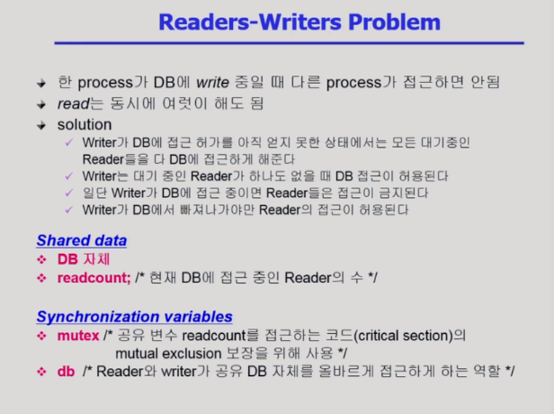

- 읽고 쓰는 문제는 DB에서 흔히 일어난다.
- 가장 쉬운 솔루션은 DB에 들어오는 모든 요청에 락을 걸어서 사용하는거지만, 효율성이 떨어지기 때문에 필요한 상황에만 락을 걸게하는 방식이 필요한다.
- 보통 Reader 만 있다면 다수 접근을 허용하고 Writer에서 락을 사용하는 방식을 한다.
  - Reader에 다수를 접근시키는 방식을 살펴보면 readcount가 필요한다. 현재 DB에 몇개의 Read가 수행되는지 카운트 변수이고, read가 들어오고 나갈때 락을 걸어서 이 count를 조절한다.

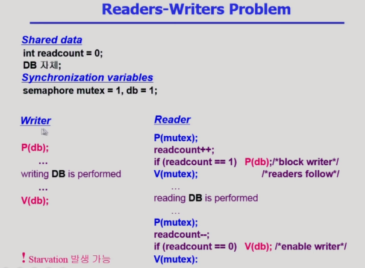

- Wirter는 락을 걸고 수행하고 락을 푸는 전형적인 과정이다.
- Reader는 락을 걸고 count를 올리고 DB작업을 수행한다음 다시 락을 걸고 count를 내린다.
- 이 경우는 starvation이 발생할 수있다.
  - Reader가 계속 도착한다면 writer가 작동할 수 없다.
  - 신호등같은 로직을 이용해서 해결할 수 있다. 아니면, 큐를 이용해서 wirter가 들어오고 대기하는것을 알 수 있다.

### 동기화 문제 3

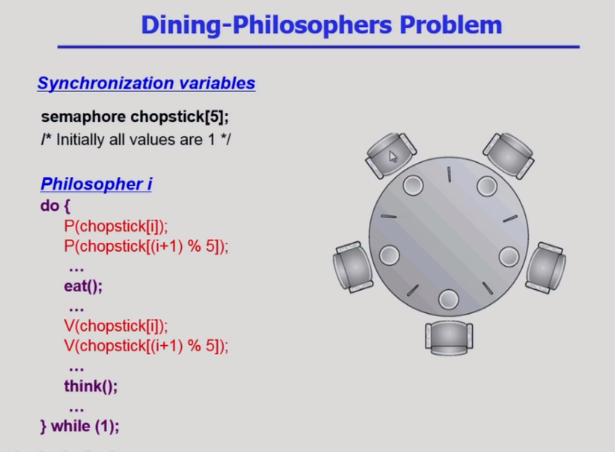

- 원탁의 철학자 문제라고도 한다. 밥을 먹기위해 공유데이터인 젓가락을 사용해야 하고, 양쪽 두개를 얻어야 먹을 수 있다고 가정한다. 여기서 어떻게 효율적으로 공유데이터를 관리할지 문제이다.
- 코드를 보면 동시에 왼쪽 젓가락을 잡을때 데드락이 발생하는 문제가 있다.

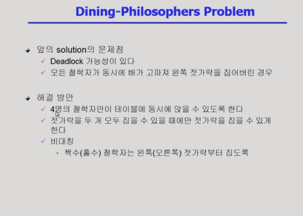

- 결국 사람을 줄이거나 자원을 늘리는 해결책이 있다.
- 다음으로 양쪽 두개를 잡을 수 있는 경우에만 자원을 획득하게 한다.
- 모두 왼쪽을 바라보게 하지 않고, 비대칭으로 번갈아서 먼저 젓가락을 잡게한다.

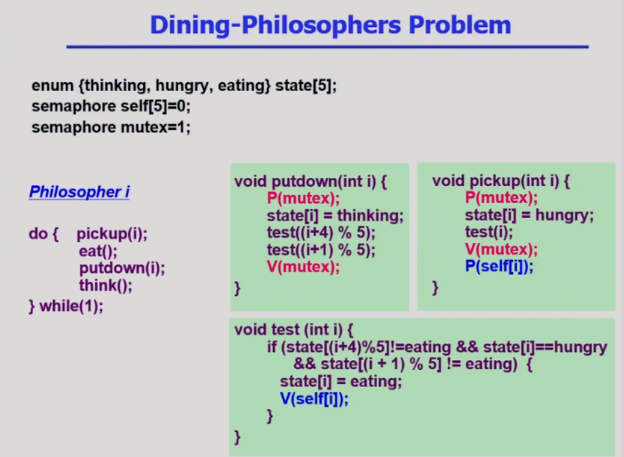

- self[5]를 이용해서 젓가락을 잡을 수 있는지 확인한다. 기본은 0으로 둬서 아무도 사용할 수 없다고 한다.
- 잡을수 있는 권한을 젓가락을 들거나 내려놓는 함수로 관리한다. 젓가락을 잡을 때 test를 수행한다.

### Monitor

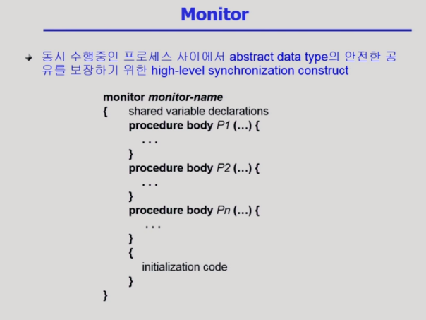

- 공유되는 자원을 모니터가 책임진다. 공유데이터 접근은 모니터 내부 함수로만 접근이 가능하다. 

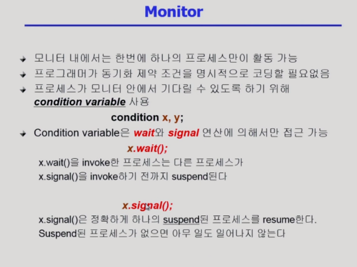

- 락을 걸지 않고 순차적으로 사용하는 방식이다. 
- produce를 이용해서 빈 버퍼가 있는지 보고 없다면 기다린다. 빈 버퍼가 생기면 데이터를 집어넣는다.
- consume를 이용해서 데이터가있는 버퍼가 없으면 기다린다. 데이터가 있는 버퍼가 오면 사용한다.

### 데드락

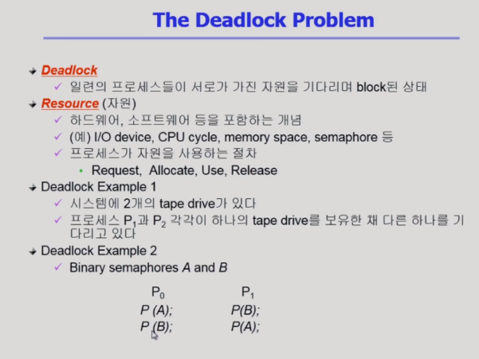

- CPU에서 서로가 가진 자원을 원하는 상황에서 대기할때 데드락이 발생한다.

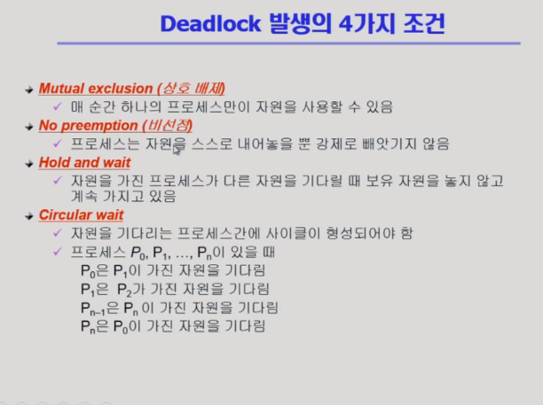

- 위 4가지 경우가 모두 만족될때 데드락이 발생할 수 있다.
- 따라서 데드락을 해소하기 위해서는 위 4가지 조건중 하나를 깨서 해결한다.

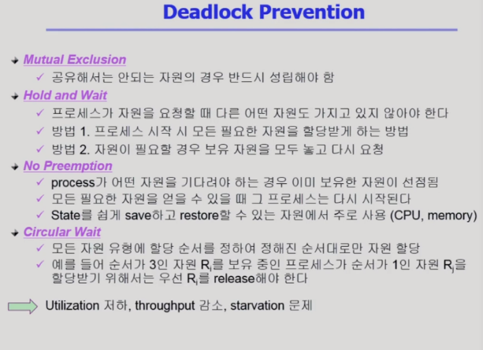

- 위 방법으로 각각 문제들을 해결 할 수 있다.
- 문제를 해결할 수 있지만, 그것이 효율성을 말하는것은 아니다. 각자 상황에 맞는 연산처리가 적은 방법을 사용해야한다.
- 데드락이 잘 발생하지 않는 상황이라면 더 자원 효율적인 방식을 사용한다.
- 프로세스는 개발되는 시점에서 자원을 얼마나 사용할지 예측할 수 있다. 따라서 데드락의 위험성이 있는지 확인하고 보수적으로 다룰지 아닐지 판단해서 사용한다.

