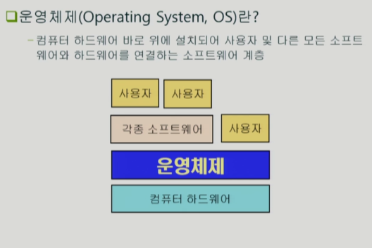
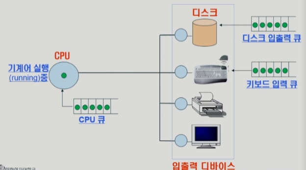
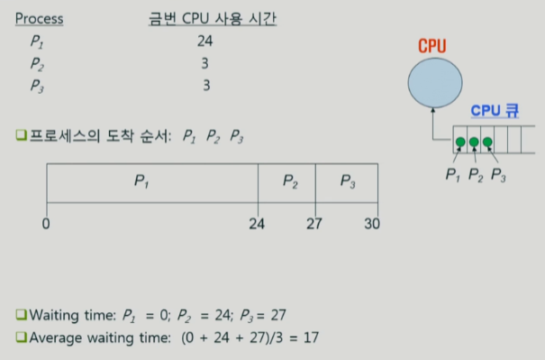
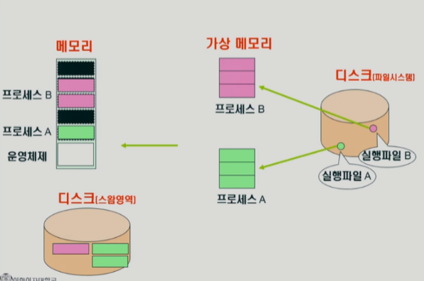
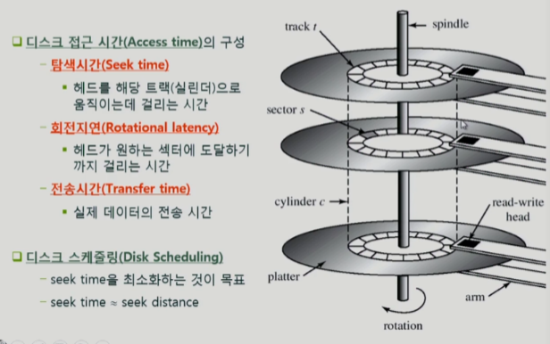
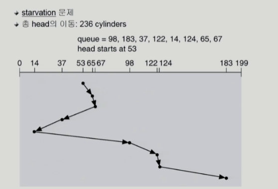
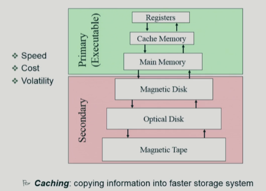
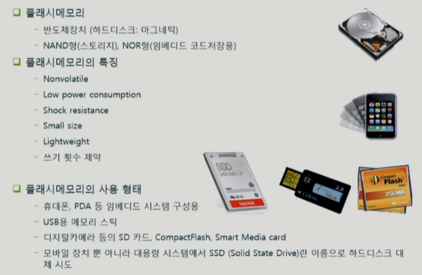

# 운영체제 1강

> 본 글은 KOCW 반효경 교수님의 강의를 정리한 기록입니다. 
> 강의는 무료로 공개되어 있습니다.
> (링크: http://www.kocw.net/home/m/search/kemView.do?kemId=1226304)

### 운영체제란?

- 컴퓨터 하드웨어를 다루기 위한 관리 프로그램이다
- 사용자가 소프트웨어 관점에서 편리하게 기능을 사용하게한다.
  - 다양한 프로그램/프로세스가 하나의 컴퓨터에서 돌아간다. 이를 동시에 실행하게 도와준다.
- 하드웨어 자원을 관리하는데 도움을 준다.
  - CPU, 메모리, I/O 장치 등을 효율적으로 관리한다.
  - 각각 프로세스가 형평성을 가지고 자원을 할당받도록 한다.

### 컴퓨터 시스템 구조

- 컴퓨터 내부
  - CPU
    - 매 시간(클럭)마다 메모리를 읽어다가 실행한다.
    - 한정된 시간을 각 프로그램에 주어서 CPU를 쓰게한다.
  - 메모리
    - 운영체제가 올라가있다. (커널)
    - 프로그램을 실행하면 메모리에 올라간다.
    - 한정된 메모리를 어떻게 프로그램에게 줄지 관리한다.
- 입출력(I/O) 장치 (외부)
  - 디스크
    - 엄밀하게 하드디스크 같은것은 외부장치로 본다.
    - 디스크는 내부 장치에 비해 매우 느린 장치이다. 따라서 디스크에 CRUD요청이 여기저기서 날라왔을때 어떤 방식으로 처리할지 관리해야한다. 디스크 스케줄링을 이용해 처리한다.
    - 디스크가 느리기 때문에 인터럽트와 캐싱을 이용해서 보관했다가 바로 보내준다.
  - 마우스/키보드
  - 모니터

### 프로세스

실행중인 프로그램을 프로세스라고 한다.

- CPU는 큐를 이용해서 짧은시간 실행하고. 큐에 넣는 방법으로 공평하게 프로그램을 실행한다.
- 디스크와 키보드는 큐를 이용해서 각자 업무를 순차적으로 처리한다.

### CPU 스테줄링

- 프로세스 3개가 지금 CPU를 사용하기 위해 대기한다고 보자. 간발의 차이로 123 순서로 도착했지만, 모두 같은 시간에 도착했다고 생각하자.
- FCFS(first come first served)
  - 먼저온 작업을 먼저한다.
  - 공평해 보이나 효율적이지는 않다. 오래걸리는 프로세스가 앞에있는경우 불리하다.
- SJF (shortest job first)
  - 가장 짧게쓰는 프로세스에 먼저 우선권을 주자.
  - 평균 대기시간을 가장 짧게 만드는 방법이다.
  - Starvation: 긴 프로그램이 무한히 기다려야 하는 경우가 발생할 수 있다. 
- RR (round robin)
  - CPU+하드웨어가 프로세스에 할당을 빼앗아서 지속적으로 자원을 교환한다.
  - 대기 시간이 프로세스 CPU 사용시간에 비례한다.

### 메모리관리

- 필요할때 디스크에 가상 메모리가 만들어지고, 필요할때 진짜 메모리에 올라가는 형태이다.
- 만약 진짜 메모리 크기가 다 차면, 디스크 스왐영역에 임시로 보관한다. 여기는 메모리의 연장공간이다.
  - 어떤 페이지를 디스크 스왐영역에 둘것인가?
  - 과거를 보고 가장 사용성이 낮을것 같은 것을 보낸다.
    - LRU (least recently used)
      - 가장 오래전에 참조(사용) 페이지를 보낸다. 최근에 사용된게 다시 사용될것이라 생각
    - LFU: (least frequently used)
      - 사용회수가 가장 적은 페이지를 보낸다.

### 디스크 스케줄링

- 디스크 회전지연&전송 시간은 짧다. 대부분의 시간 소요는 탐색 시간에서 발생한다.

- SSTF (shortest seek time first)
  - 현재 위치에서 가장 가까운 위치를 탐색한다.
  - 매우 멀리있는 위치는 기아문제가 발생할 수 있다. (공평성 문제)
- SCAN 
  - 엘리베이터와 비슷한 방식으로 움직인다.
  - 디스크의 방향을 이동하면서 중간에 필요한것을 처리하는것이다.

### 캐싱

- 주기역장치와 보조기역장치를 계층으로 나타낸다.
- 내용물 구성은 조금씩 바뀔 수 있다.
- 위로 올라갈수록 빠르고, 용량이 작고. 비싸다.
- 초록색은 다 휘발성이다. Primary는 CPU가 직접 접근할 수 있다는 의미이다.
- 계층이 있다는것은 위에서 필요한 데이터가 아래로부터 올라가고, 그 이후에 맨 아래로 내려가는것이 아니라 중간에 있는것들이 다시 올라가서 이동경로를 줄일 수 있다는 효과가있다.

### 플래시 메모리

