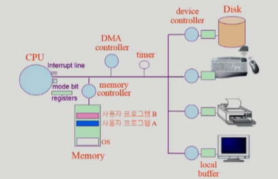
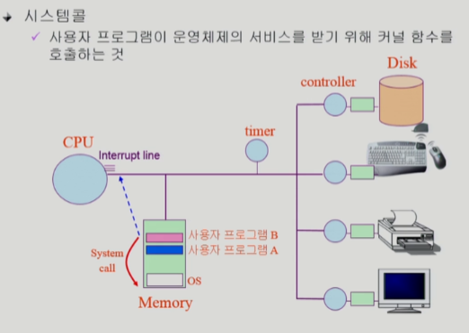
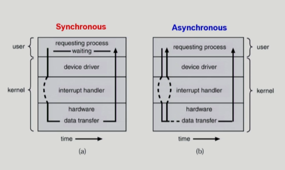
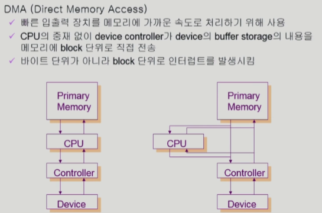

# 운영체제 2강

> 본 글은 KOCW 반효경 교수님의 강의를 정리한 기록입니다. 
> 강의는 무료로 공개되어 있습니다.
> (링크: http://www.kocw.net/home/m/search/kemView.do?kemId=1226304)

### 컴퓨터 시스템 구조

- 컨트롤러와 메모리들을 이용해 구성되어있다.

- CPU는 운영체제를 통해 실행되고, 메모리에 있는 사용자 프로그램에 CPU를 넘겨주어 실행한다.

  프로그램 counter가 있어서 어떤 메모리 프로그램을 실행할지 알려준다.

- CPU를 프로그램이 사용하다가, 운영체제+하드웨어를 이용해서 CPU를 다시 되찾아 온다. 이를 mode bit이 한다.

  - mode bit은 운영체제가 실행할때는 0으로 모든 CPU 기능이 사용된다.
  - 사용자 프로그램에 CPU를 넘길때는 mode bit을 1로 만들어서 실행 기능을 제한한다.
  - Interrupt line은 운영체제가 CPU를 사용하다가 사용자 프로그램에 CPU를 넘기게 한다.

- 운영체제가 CPU를 넘겨줄때 Timer를 키고 넘겨준다. Timer가 끝나면 interrupt가 CPU를 다시 빼앗아온다.

#### 인터럽트

- 인터럽트
  - 인터럽트 당한 시점의 레지스터와 counter를 저장한 후 CPU제어를 인터럽트 처리 루틴에 넘긴다.
  - 현대 운영체제는 인터럽트에 의해 구동된다.
- 사용자 프로그램이 기계어를 통해 OS에게 종료를 알리고, OS가 interrupt line을 통해 CPU를 반납할 수 있다.

### 입출력

- 동기식 (synchronous)
  - 요청과 결과가 동시에 일어난다는 약속이다. 일이 들어오면 그것을 지금 끝내준다는 의미다.
  - 큐 같은 방식으로 직관적으로 설계가 가능하다. 
  - 작업이 길어지면 모두가 기다리는 단점이 있다.
  - 하나의 작업이 완료된 후에 다음작업이 이어서 실행됨.
  - '싱크가 맞다'라는 일반적인 표현을 생각하면 좋다.
- 비동기식 (asynchronous)
  - 동시에 일어나지 않는다. 요청결과가 지금 실행되지 않을수도 있다는 의미.
  - 시간이 걸리더라도 다른 작업을 동시에 할수있으므로 효율적이다.

### DMA controller

- 빈번하게 CPU가 교환되면 효율이 떨어지기때문에 이를 방지하는 장치
- 메모리에 직접 접근하여 올려놓고 CPU를 부르기 위함이다.

