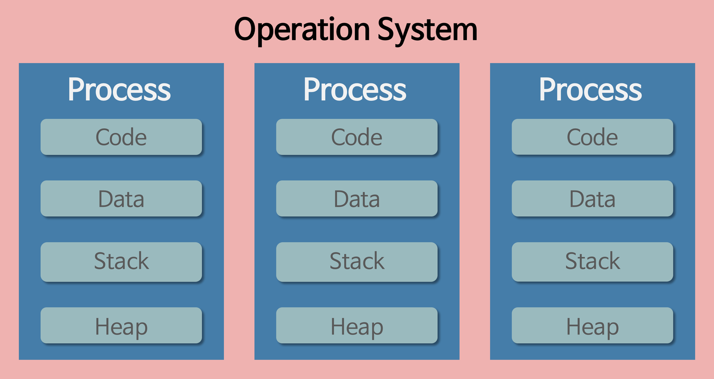
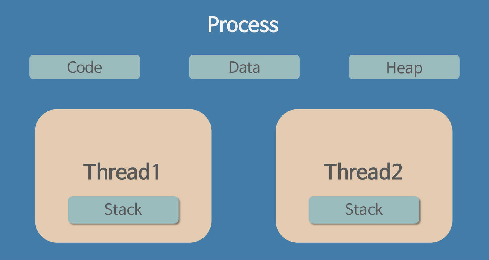

# 프로세스 & 스레드

> 앞서 다른 정리에도 프로세스와 스레드에 대한 개념이 있다. 매우 기본적이고 계속 등장하는 개념이지만, 한번씩 비교해서 정리하는것이 내가 알고있다는 착각에서 도와준다. 
>
> 다시금 프로세스와 스레드를 비교하며 정리해보았다.

### Process

#### 다양한 설명

- 컴퓨터에서 연속적으로 실행되는 프로그램
- 메모리에 올라와 실행되고있는 프로그램의 인스턴스 (독랩 개체)
- 운영체제로부터 시스템 자원을 할당받은 작업 단위
- 동적 개념으로 실행된 프로그램

#### 구조

- CPU를 차지하는 시간과, 메모리 공간을 할당받는다.
- 메모리는 독립되어 있으며 Code, Data, Stack, Heap으로 구성한다.
- 프로세스는 한개 이상의 스레드를 가진다.
- 기본적으로 프로세스는 독립적으로 다른 프로세스에 접근할 수 없다.
- 프로세스간의 통신을 위해 IPC 방법이 있다.

### Thread

#### 다양한 설명

- 프로세스 내에서 실행되는 여러 흐름
- 프로세스의 특정한 수행 경로
- 프로세스가 할당받은 자원을 이용하는 실행 단위

#### 구조

- 스레드는 프로세스 내에서 Stack을 나눠가진다. 나머지 Code, Data, Heap은 같이 사용한다.
- 따라서 공유되는 영역을 락을 통해 충돌을 방지해서 사용하며, 서로 변경한 부분에 대해 접근이 가능하다.

### Java Thread

- 스레드와 유사한 환경을 JVM (가상환경)에서 구현하였다.
- 자바에서는 프로세스가 존재하지 않고 스레드만 존재하며, JVM에 의해 스케줄되는 실행단위 코드 블록이다.
- 개발자가 스레드 관리 코드를 작성하면, JVM이 이를 수행하는 구조이다.

### 멀티 프로세스

- 하나의 응용 프로그램을 여러개의 프로세스로 구성해서 작업하는 방식이다.
- 독립적으로 프로세스를 구성한다면, 하나 프로세스에서 에러가 전체 프로그램 수행에 영향을 주지않는 장점이 있다.
- 단점으로는 Context Switching에 소요되는 시간이 필요하다. 개발이 어렵다.

### 멀티 스레드

- 하나의 프로그램을 여러개의 스레드로 구성해서 처리하게 한다.
- 웹 서비스가 대표적인 멀티 스레드 응용 프로그램이다.
- 프로세스를 새로 생성하여 자원을 할당하는 시스템 콜이 발생하지 않아 자원관리에 효율적이다.
- 단점으로는 스레드간의 안정성을 확보하게 개발해야 하며, 에러 발생시 디버깅이 어려울 수 있다.
