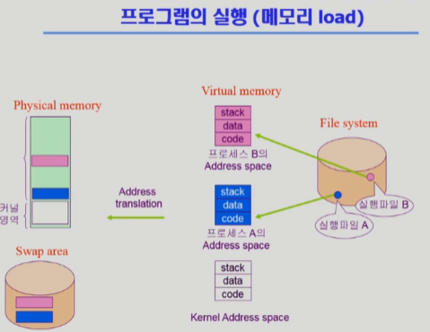
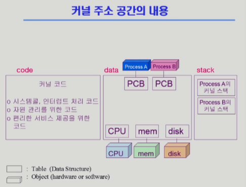
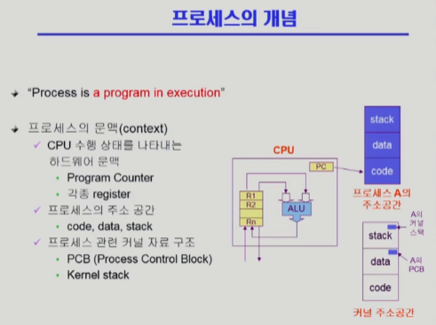
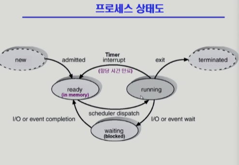
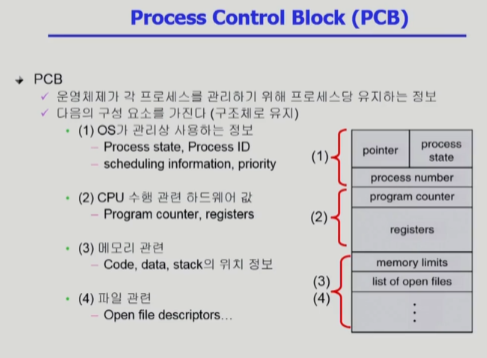
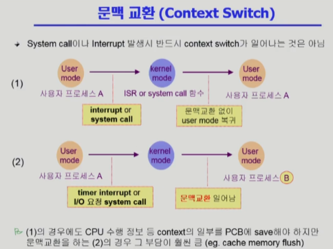

# 운영체제 3강

> 본 글은 KOCW 반효경 교수님의 강의를 정리한 기록입니다. 
> 강의는 무료로 공개되어 있습니다.
> (링크: http://www.kocw.net/home/m/search/kemView.do?kemId=1226304)

### 메모리 관리

- 전체를 가상 메모리에 만든다음, 필요한 부분을 메모리에 올리는 방법으로 동작한다.
- 여기는 stack, data, code로 구성되는데 코드는 기계어를 말하는것이고, data는 사용하는 변수들의 데이터가 저장된다. stack은 코드가 함수로 동작하기때문에 함수가 올라갔다가 반환되었다가 하기위한 공간이다.

### 커널 주소 공간

- 커널 코드는 프로그램을 돌리는것 이외에 직접 할수 없고 OS에 요청해야하는 시스템콜까지 있다.
- stack은 함수를 다루는 공간이다. 함수는 사용자 정의함수도 있지만, 라이브러리나 커널에서 제공하는 함수도 있다.
- 운영체제는 커널함수를 제공하며, 시스템 콜도 이에 속한다.

### 프로세스

- 프로세스는 프로그램을통해 탄생한 내용이다.
- 프로세스가 자원을 차지하고, 커널의 주소공간을 사용하고 하는 전체적인 일이 일어난다.
- 프로세스는 PCB에 의해서 관리된다.
- 프로세스는 3개의 상태를 가진다.
  - running 상태, ready 상태, blocked 상태(지금 실행이 불가능해 기다리는 상태)

### 프로세스 상태

- 프로세스가 시작되기 전이나, 프로세스가 끝난다면 그것은 더이상 프로세스가 아니다.
- 프로세스가 메모리에서 준비되어있다가, 자원을 할당받으면 러닝된다.
- 시간이 만료되면 다시 준비상태로 있는다.
- 지금 실행할 수 없는 프로세스라면 blocked상태가 된다.
- 모든 과정이 완료되면 terminated된다.

### 프로세스 컨트롤

### 문맥교환

문맥교환은 CPU가 다른 프로세스로 넘어가는 것이다.

- 여기서 1번은 문맥교환이 아니다. interrupt가 수행된것으로 CPU가 OS로 넘어갔기 때문에 문맥교횐이 아니다. 이 상황은 A가 계속 실행된다.
- 2번의 경우에는 OS커널이 발생하고 B로 갔기 때문에 문맥교환이다. 이때는 A를 저장하고, B를 실행한다.

3.2부터 다시시작

http://www.kocw.net/home/m/search/kemView.do?kemId=1226304
