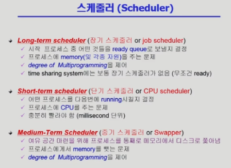
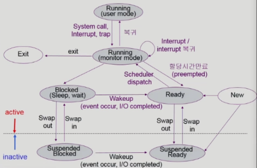
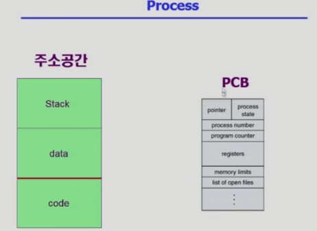
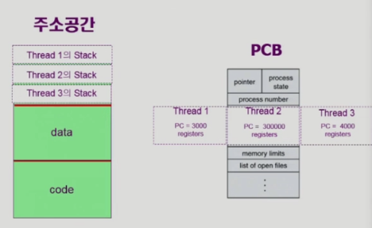
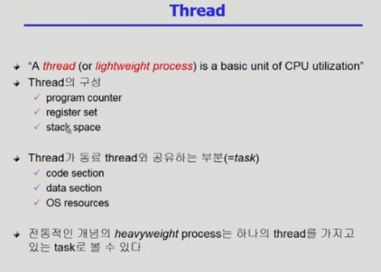
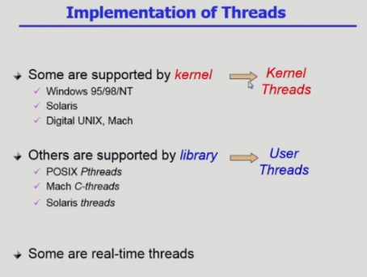
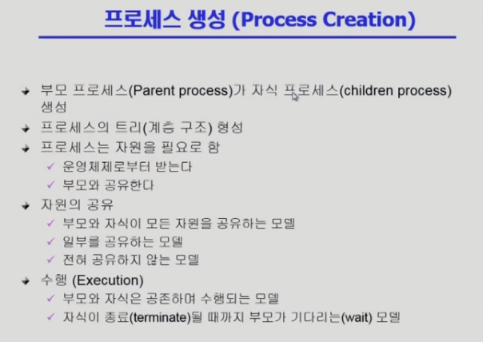
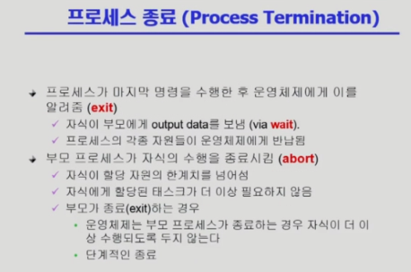

# 운영체제 3강

> 본 글은 KOCW 반효경 교수님의 강의를 정리한 기록입니다. 
> 강의는 무료로 공개되어 있습니다.
> (링크: http://www.kocw.net/home/m/search/kemView.do?kemId=1226304)

### 메모리 관리

- 전체를 가상 메모리에 만든다음, 필요한 부분을 메모리에 올리는 방법으로 동작한다.
- 여기는 stack, data, code로 구성되는데 코드는 기계어를 말하는것이고, data는 사용하는 변수들의 데이터가 저장된다. stack은 코드가 함수로 동작하기때문에 함수가 올라갔다가 반환되었다가 하기위한 공간이다.

### 커널 주소 공간

- 커널 코드는 프로그램을 돌리는것 이외에 직접 할수 없고 OS에 요청해야하는 시스템콜까지 있다.
- stack은 함수를 다루는 공간이다. 함수는 사용자 정의함수도 있지만, 라이브러리나 커널에서 제공하는 함수도 있다.
- 운영체제는 커널함수를 제공하며, 시스템 콜도 이에 속한다.

### 프로세스

- 프로세스는 프로그램을통해 탄생한 내용이다.
- 프로세스가 자원을 차지하고, 커널의 주소공간을 사용하고 하는 전체적인 일이 일어난다.
- 프로세스는 PCB에 의해서 관리된다.
- 프로세스는 3개의 상태를 가진다.
  - running 상태, ready 상태, blocked 상태(지금 실행이 불가능해 기다리는 상태)

### 프로세스 상태

- 프로세스가 시작되기 전이나, 프로세스가 끝난다면 그것은 더이상 프로세스가 아니다.
- 프로세스가 메모리에서 준비되어있다가, 자원을 할당받으면 러닝된다.
- 시간이 만료되면 다시 준비상태로 있는다.
- 지금 실행할 수 없는 프로세스라면 blocked상태가 된다.
- 모든 과정이 완료되면 terminated된다.

### 프로세스 컨트롤

### 문맥교환

문맥교환은 CPU가 다른 프로세스로 넘어가는 것이다.

- 여기서 1번은 문맥교환이 아니다. interrupt가 수행된것으로 CPU가 OS로 넘어갔기 때문에 문맥교횐이 아니다. 이 상황은 A가 계속 실행된다.
- 2번의 경우에는 OS커널이 발생하고 B로 갔기 때문에 문맥교환이다. 이때는 A를 저장하고, B를 실행한다.

### 스케줄러

- 스케줄러는 OS 내부 코드라고 생각하자
- 장기스케줄러
  - 메모리를 관리한다.
  - 프로세스가 메모리를 얻을 수 있는것은 admitted 단계이다.
  - 프로세스가 메모리에 들어갈 수 있에 허락하는 역할이 장기스케줄러가 한다.
  - 요새 일반적인 OS는 장기스케줄러가 없고 곧바로 ready 상태로 들어간다.
- 단기스케줄러
  - CPU를 누구에게 얼마나 줄지 결정한다.
  - CPU는 자주 넘어가기때문에 자주 호출된다.
- 중기스케줄러
  - 요새 OS는 장기스케줄러가 없기때문에 중기스케줄러가 생겼다.
  - 메모리가 부족할때 특정 프로세스를 메모리에서 뺏는다.
  - 위 프로세스 상태 3개(Running, ready, blocked)에서 중기스케줄러 때문에 suspended가 추가되었다.
    - running, ready, blocked는 실행중인 프로세스이다.
    - suspended는 stop된 상태이다.

### Suspended가 추가된 상태도

- Active
  - CPU를 얻지 못하더라도 IO작업을 하고있는 Blocked도 활성 상태이다.
  - Running은 user/monitor 모드로 구분할 수 있다.
  - OS에서 CPU권한을 가지는 interrupt가 발생하더라도, Running은 process가 가지고있다고 본다.
- Inative
  - 메모리에 없는 상태이다.
  - 외부에서 메모리를 다시 부여해야 active상태로 될 수 있다.
  - Suspended blocked는 IO작업을 하고있는 경우다. IO작업이 끝나면 ready가된다.

### Thread

- 프로세스는 주소 공간과 PCB로 구분할 수 있다.
- 이는 프로세스마다 생성되어 독립적으로 가지게된다.
- 하지만, 같은 역할을 하는 프로세스가 여러개 띄어질때, stack과 register만 다른 기능을 한다면, 다른것은 공유하는게 좋을것이고 이를 위해 만들어진 개념이 thread이다.

- 각각의 thread는 서로다른 code부분을 실행할 수 있다. 

  문맥교환(context switch)가 발생하지 않아 넘어가는데 효율적이다.

- PCB에서 program counter값을 각각 관리한다.

- 함수를 실행하고 호출하는 stack을 별도로 관리한다.

- 이때문에 서로다른 thread에서 data를 참조할때 충돌을 주위해서 code를 작성해야한다.

  또한, 같은 data를 공유하는것은 보안상의 문제가 될 수 있다는점을 조심해야한다.

- Thread가 가지는 부분과 공유하는 부분은 위와같다.
- 프로세스 내부에서 독자적으로 가지는 부분을 thread, 공유하는 부분을 task라고 부른다.
- Thread의 장점은 프로세스 내부에서 어떤 thread가 blocked 상태라도 그것을 동기적으로 기다리는게 아니라, 비동기로 다른 thread가 돌아갈 수 있기때문에 더 빠르게 일처리가 된다. 이를 병렬성이라고 한다.

### Thread 구현

- 운영체제가 알고있게 구현하는 방법을 Kernel thread이다.
- 운영체제가 thread인지 모르게 만드는것을 user thread이다.
  - 운영체제는 그냥 process에 cpu를 주는것이고, 내부에서 비동기를 구현한다.

### 프로세스 생성

- 프로세스가 자식프로세스를 만드는것은 복제 생성이다. 같은 과거를 가지고 만들어진다.

  System call로 OS에 요청(fork)하고, 이를 만들어주는 주체는 OS이다. 메모리와 PCB를 만들어준다.

- fork는 부모 프로세스를 복제해서 자식 프로세스를 만드는 과정이다. 새로운 프로세스를 올리고 싶은 경우에는 fork를 하고 exec으로 메모리에 덮어 씌워 올린다.

### 프로세스 종료

- 자식을 만들었는데, 시킬일이 없으면 exit으로 종료한다.
- 기본은 자식이 죽고 부모가 죽는게 일반적이다. 만약 부모가 죽어야한다면 자식을 먼저 죽여서 종료시킨다.
- fork후에 return값을 받게 되어 (자식은 0 부모는 자식 ID를 받음) 누가 자식이고 부모인지를 구분하게된다.
