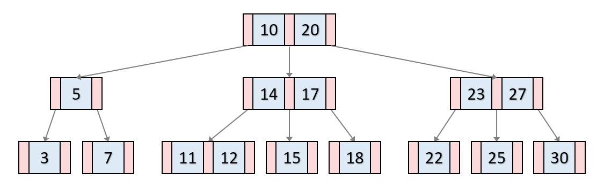
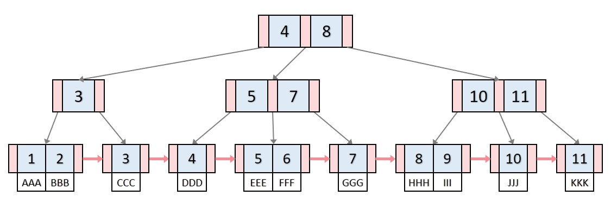

# B & B+ tree

## B tree

B 트리는 리프 노드가 같은 레벨을 가지게 만든 자료구조이다. 기본적으로 검색을 위해 탄생하였다. 벨런스 트리기에 정렬된 순서를 보장하고, 검색 속도를 높인다.

B tree는 왼쪽 자식은 나보다 작고, 오른쪽 자식은 나보다 큰 수를 나타내는 방식으로 찾아간다. 이때 위 그림에서 분홍색처럼 각각 자식을 찾을 수 있는 포인트 주소가 기록되어있다.

### 찾는과정

root부터 알맞은 값을 찾아 이동한다. 두개의 값을 보고, 값이 작으면 왼쪽 자식노드로, 값이 사이에 있으면 사이에 있는 자식노드로, 값이 크면 오른쪽 자식 노드로 이동하게 된다. 여기서 다시 3가지 갈래로 나눠진 다음 자식으로 이동하면서 알맞은 수를 찾는다.

### 삽입과정

분할이 일어나지 않는 경우는 알맞은 위치에 데이터를 찾아서 삽입하고 종료한다. 만약 노드에 3개 이상의 값이 존재하면 분할이 발생하여 가운데 값을 위로 올린다. 여기서 알맞은 자리에 들어가거나, 알맞은 자리가 없으면 지속적으로 올라가서 최종 root level까지 올라갈 수 있다.

## B+ tree

동작 방식은 B tree와 비슷하나, 리프 노드들이 연결리스트 형태를 가진다는 특징이 있다. 이러한 특징때문에 선형 검색이 가능하다.

B tree에 비해 달라진 점은 모든 데이터값은 리프노드에 있다는 점입니다. 또한 리프 노드가 연결리스트 형태를 띄어서 각 리프 노드에서 다음 데이터 위치를 찾을 수 있습니다. 이는 범위를 조회할때 유리합니다.
