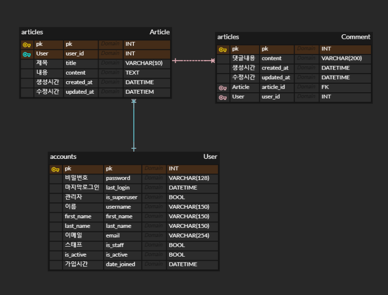

# ERD cloud

> 점점 사용하는 DB가 복잡해지면서 한눈에 ERD를 설계하고 싶었다. 분명 이를 그려주는 프로그램이 있을것 같아 찾았고, 역시 다양한 프로그램이 있더라. 그중 개인사용이 무료이며 설치없이 사용가능한 ERD cloud를 사용해보기로 정하고하고 공부한다.

## ERD cloud란?

웹 기반으로 설치없이 사용가능한 RRD 작성 프로그램이다. 

## ERD cloud 장단점

### 장점

상용법이 일단 직관적이고 간단해보인다. 처음 튜토리얼 동영상으로 필수적인 기능은 이해되었다.

### 단점

고급기능과 다른 프로그램과의 연동은 불가능하다. 

내가 사용법을 모를수도 있으나, 수정이 매우 불편하다 (실행 취소로밖에 수정이 안됨)

## 오늘의 결과

