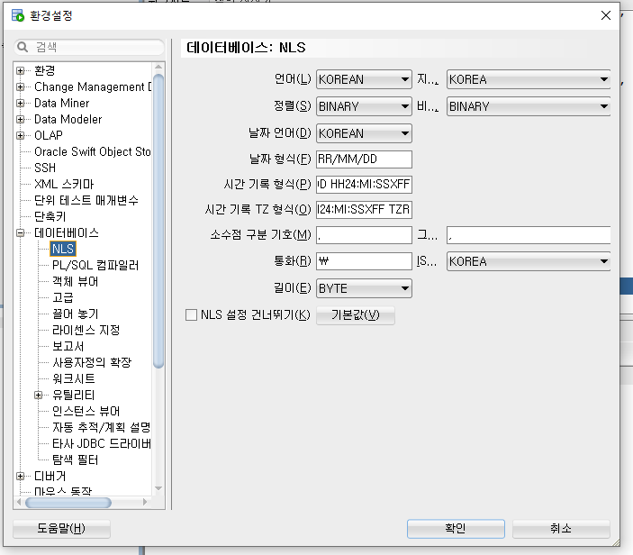

## 단일행 함수

> 단일행 함수는 하나의 행(row)에서 하나의 결과를 리턴한다.

### 문자열 함수

#### LOWER / UPPER /INITCAP

문자열의 대소문자를 조작

```
select LOWER('ORACLE sql')
from   dual;
-> 'oracle sql'
```

```
select UPPPER('ORACLE sql')
from   dual;
-> 'ORACLE SQL'
```

```
select INITCAP('ORACLE sql')
from   dual;
-> 'Oracle Sql'
```


#### CONCAT

문자열 2개를 하나로 합친다. 3개 이상 요소에서는 사용할 수 없다. (충첩해서 써야함)

```
select CONCAT('HI', 'ORACLE')
from   dual;
-> HIORACLE
```


#### SUBSTR

SUBSTR(word, n1, n2)라고 할때, word에서 n1부터 n2개 자리수를 반환한다.

공백도 한개 문자로 취급한다.

n1이 음수가 나온다면 뒤에서부터 indexing한다.

```
select SUBSTR('Hi my name is word', 2, 4)
from   dual;
-> i my
```


#### LENGTH

문자열의 길이를 반환한다.

```
select LENGTH('Hi my name is word')
from   dual;
-> 18
```


#### INSTR

INSTR(word, s1, n1, n2)라고 할때, word에서 n1 자리수 부터 s1이 n2번 나오는 위치를 반환한다.

n1, n2는 생략할수 있으며 그럴경우 기본값은 1이다.

조건에 맞는 s1을 찾지 못하면 0을 반환한다.

```
select INSTR('Hi my name is word', 'i', 1, 2)
from   dual;
-> 12
select INSTR('Hi my name is word', 'i', 3, 1)
from   dual;
-> 12
select INSTR('Hi my name is word', 'i', 3, 2)
from   dual;
-> 0
```


#### LPAD / RPAD

LPAD(word, n1, s1)라고 할때, word를 n1자리로 만들고 부족한 자리에는 s1으로 채운다.

word 자리수가 n1을 초과하면 n1개까지만 출력한다.

```
select LPAD('hi', 5, '*')
from   dual;
-> ***hi
select RPAD('hi', 5, '*')
from   dual;
-> hi***
select RPAD('hiaaaaaaaa', 5, '*')
from   dual;
-> hiaaa
select RPAD('hi', 5, '*/')
from   dual;
-> hi*/*
```


#### REPLACE

REPLACE(word, s1, s2)라고 할때, word의 s1을 s2로 변경한다.

```
select REPLACE('Hi my name is word', ' ', '')
from   dual;
-> Himynameisword
```


#### REVERSE

문자열을 거꾸로 뒤집는다.

```
select REVERSE('Hi my name is word')
from   dual;
-> drow si eman ym iH
```


### 숫자 함수

#### ROUND

ROUND(num, n1)라고 할때, num을 소수점 n1자리까지만 나타나게 반올림한다.

음수를 쓰면 10의자리를 나타낸다

```
select ROUND(456.123, 2)
from   dual;
-> 456.12
select ROUND(456.123, 0)
from   dual;
-> 456
select ROUND(456.123, -1)
from   dual;
-> 460
```


#### TRUNC

TRUNC(num, n1)라고 할때, num을 소수점 n1자리까지만 나타나게 뒤를 버린다.

```
select TRUNC(456.888, 2)
from   dual;
-> 456.88
select TRUNC(456.888, 0)
from   dual;
-> 456
select TRUNC(456.888, -1)
from   dual;
-> 450
```


#### MOD

MOD(num , n1)라고 할때, num을 n1으로 나눈 나머지를 반환한다.

```
select MOD(456, 2)
from   dual;
-> 0
select MOD(456, 5)
from   dual;
-> 1
```


#### SIGN

SIGN(num)라고 할때, num이 양수이면 1 음수이면 -1을 반환한다.

```
select SIGN(456)
from   dual;
-> 1
select SIGN(-456)
from   dual;
-> -1
```


### 날짜 함수

오라클은 날짜 데이터를 아래와 같이 저장한다.

- Date: centry, year, month, day, hour, minute, second
- Timestamp: [Date 전부] + 시간대(지역정보)



yyyy/mm/dd hh24:mi:ss

```
select sysdate, current_date, systimestamp, current_timestamp
from   dual;
-> 2022/11/22 13:17:02	
2022/11/22 13:17:02	
22/11/22 13:17:02.002000000 +09:00	
22/11/22 13:17:02.000000000 ASIA/SEOUL
```


#### 시간대(Time zone) 변경

```
alter session set time_zone = '0:00';
```

- session은 현재 작업하는 창 범위
- 한국은 `alter session set time_zone = '9:00';`


#### 사칙연산

```
-- DATE +(-) NUM
select current_date + 1
from   dual;
-> 2022/11/15 22:29:06

-- DATE +(-) DATE

-- DATE +(-) NUM/24
```


#### MONTHS_BETWEEN(D1, D2)

```
select first_name, hire_date, months_between(current_date, hire_date)
from   employees;
```


## 그룹 함수

> 그룹 함수는 다중 행(row)에서 하나의 결과를 리턴한다.