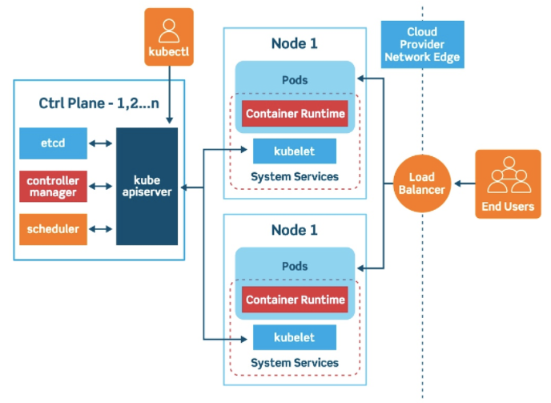

# Kubernetes architecture

> k8s를 공부하기 위해 어떠한 기술이고, architecture가 어떻게 구성되는지 큰 그림을 잡으면서 시작한다.

### k8s는 어떤 문제를 바탕으로 출발했나

- 도커를 관리하기 위한 도구가 필요했고, k8s가 나왔다.
- 여기서 가장 중요한 기능은 vm 환경이 죽었을때 다른 pod로 옮기고, pod간이 통신을 다루고, pod가 추가될때 로드벨런싱을 조절하는 등 문제를 담당한다.
- CI/CD 툴로서 분류되기도 한다.

### CI/CD는 무엇인가

- CI
  - CI/CD, devops 이러한 단어는 방법론(철학)이다. 특정 툴을 지칭하지는 않는다.
  - CI 지속적 통합은 개발자가 각자의 branch에서 개발하고 main에 합치는 과정이다.
  - 순수하게 용어적으로 의미는 각자의 개발 코드를 main branch에 자주 커밋해서 싱크를 맞춘다는 의미이다. 이를통해 빠른 문제파악이 가능하다.
- CD
  - 지속적 전달/배포라는 의미이다.
  - `빌드 - 테스트 - 배포` 과정으로 진행된다. 이를 자동화한다.
- 코드가 commit push가 발생하면, 자동으로 배포되는 과정을 CI/CD라고 한다.
- 이론상으로 이러하나, 자동으로 배포되는데 위험이 있을 수 있으므로 모든 과정이 일반적이라고 볼 수 없다.
  - 이러한 의미에서 k8s는 CI/CD로 분류할 수 있지만, 그렇지 않을 수도 있다. (관점에 따라 다름)

### k8s는 어떤 서비스인가

k8s 자체도 MSA이다. 하나의 큰 코드가 있는것이 아니라 여러개 서비스가 떠있고, 서버들간의 이벤트를 기반으로 작동한다.

기본적으로 API 호출을 통해 작동하며, json을 통해 소통한다. 하지만 yaml을 통해서 설정할 수 있고 내부적으로 json을 호출하게 할 수 있다.

### k8s architecture

1. kube ctrl
2. pod 생성 요청을 보냄
   1. container spec을 가지고있다. (나중에 Kuberlet이 참조함)
3. API 서버: pod 생성 이벤트가 발생됨
   1. Scheduler가 이벤트를 받음.
   2. Scheduler가 노드를 확인해서 어디에 pod를 생성시킬지 찾는다. 현재 시점 기준에 최적의 노드를 찾는다.
   3. Scheduler가 API서버에 post로 노드를 알려준다 (이벤트 발생)
   4. Kubelet이 이벤트를 바라보고 있다가 Scheduler가 API서버로 보낸 이벤트를 확인하고, pod spec을 바탕으로 공간을 만들어둔다. (docker run) 만든 다음에 api서버에 공간 확보한것을 알려준다.
4. EICD
   1. EICD에서 생성되는 pod를 노드에 배치한다.

### 주요 용어

- ochestration
  - 실제로 지휘자가 있는건 아니다. 각자가 이벤트를 보고있다가 이벤트가 발생하면 자신의 일을 하는것이다.
  - 이러한 이벤트를 감시하는것이 operators or controller라고 한다.
- deamon set
  - 노드가 여러개가 있을 때 하나의 노드를 골라서 띄우는 기능이다.
  - 개발할때, 이미지만 입력하면 **모든 노드**에 하나씩 해당 container를 띄어주는 역할을 한다. 즉 스케줄러가 어디에 띄울것인지 고를 필요갸 없다. Deamon set 컨트롤러가 모든 노드를 바라보고있고, 노드가 생성되면 그것도 바라본다.
  - log수집, 모니터링, apm과 같은 역할을 할때 사용한다.
- label
  - 어떤 pod를 선택하기 위해 있음
- annotation
  - pod에 설명을 붙이는 기능
- Rancher
  - 쿠버네티스와 통신할때 GUI를 이용해 다룰 수 있는 관리도구.
- Scheduling
  - Filtering
    - container 생성 요청에 가능한 pod를 뽑는과정
  - Scoring
    - Fiterling 이후 가장 최적의 pod를 찾는 과정
- ETCD
  - etcd에 모든 정보가 저장되어있어서 k8s를 백업할때 이것만 백업하면된다.
  - compaction process 방식으로 업데이트만 되고 삭제는 되지 않는 기능이다. 나중에 저장 공간이 부족해질때 가장 마지막 사용한 데이터가 삭제되는 큐와 비슷한 방식으로 사용된다.
- Leader / follower
  - Client는 Leader/follower 아무한테나 요청하더라도, 쓰기권하는 leader만 가지고있고, follower는 leader를 바라보는 구조이다.
  - 리더가 죽으면 팔로워중에서 하나가 리더가 된다.
- worker node
  - kubelet
    - pod 생성 & 상태 보고
    - node 상태 보고 (cpu, disk)
  - 컨테이너 런타임
    - 실행 담당
  - kube-proxy
    - 서비스를 만들면 api 통시에 대한 규칙들을 써준다.
    - pod로 찾아가는 길을 만든다고 생각할 수 있다.
- pod
  - 쿠버네티스 상에서 컨테이너가 구동/배포되는 최소 단위의 컴퓨팅 유닛
  - 한개 이상의 컨테이너의 집합
  - 동일한 Pod에서 생성되는 컨테이너들은 파일시스템, 네트워크 리소스, 리눅스 네임스페이스들을 공유
  - pod는 하나의 ip만 부여받고 내부에서 localhost로 통신이 가능하다. 기본적으로 하나가 붙지만, 더 만들수는 있다.
  - 내부에 pause container를 가지고있고, 여기서 ip 정보를 가지고있는다.
- CNI
  - CNI를 통해서 각 노드에 알맞게 네트워크를 연결시킬 수 있다.
  - CNI는 Daemon set으로 모든 노드에 있다. 따라서 모든 노드에 네트워크 정보를 넣을 수 있다.
  - 다양한 플러그인 (Weave, fainnel 등)을 사용하기도 한다.

