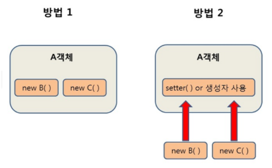

# Spring IoC & DI

> Spring FW를 사용하기 위해서 중심 이념을 알아야한다. Spring에는 자바 기반의 FW로 자바스러운 개발을 통해서 웹을 개발하도록한다. 자바스럽다는 것은 다양하나, 객체지향적인 개발을 해야하는것은 분명하다. Spring은 객체지향적인 코딩을 잘 할수있도록, 의존성에 대해서는 FW가 관리해주는데 이러한 관리를 위해서 IoC와 DI 개념이 필요하다.

## IoC (Inversion of Control)

제어의 역전이라는 의미이다.

기존의 자바 기반 App은 객체에 대한 제어를 개발자가 관리하였다. 하지만 객체의 의존성이나 라이프 주기 등을 제어하는것이 생산성을 저하시킬 수 있기 때문에 개발자가 아닌 외부 컨테이너가 관리하게 하는 방법이다.

### IoC Container

컨테이너는 객체가 생성될때 객체의 의존성을 이어준다.

이는 BeanFactory에서 기능을 정의하고있다. Bean은 IoC 컨테이너에 의해 생성되고 관리되는 객체이다.

## DI (Dependency Injection)

DI는 의존 관계 주입이라는 의미이다. 객체를 직접 생성하는것이 아니라 외부에서 생성한 후 주입하여 코딩한다.

**왜 이렇게 하는가?**

이러한 방식을 통해 모듈간의 결합도가 낮아지고 유연성이 높아진다.

**예를들면**

다음과 같이 직접 선언하기보다는 외부에서 선언된 객체에 getter setter를 이용한다.

여기서 B, C는 IoC 컨테이너에서 생성된다.

## DL (Dependency Lookup)

빈(의존관계)를 찾기위한 검색 방법이다. Spring으로 개발하는 과정에서 의존성을 주입(DI)받을 수 있지만, 의존성을 직접 검색하여 찾을 경우도 있다.

직접 검색하는데는 다양한 방법이 있다. 직접 spring API를 이용해서 호출헤도 되고, spring이 제공하는 기능을 사용해도 된다. spring의 개발 이념상 직접 API를 사용하는것은 좋은 방법이 아니다.

Spring은 Provider를 이용하여 의존성 검색을 추천한다.

### REF

- https://galid1.tistory.com/493?category=769011
