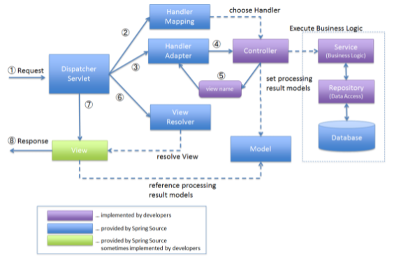

# Spring MVC

> Spring Web 개발을 위해서 MVC 패턴이 기본으로 사용된다. 기능에 맞게 분리하여 협업과 유지 보수가 유리하다. 앞서 배운 IoC와 같은 의존성관리를 통해서 역할과 책임을 분명하게 구분하는 코딩을 가능하게 한다.

## 전반적인 그림과 설명

1. 클라이언트가 요청을 보내면 프론트 컨트롤러에 요청이 들어간다.
   - 프론트 컨트롤러는 `Dispatcher Servlet`이라고 부를 수 있다. 요청을 각각 역할에 맞는 컨트롤러로 보내주기 위한 컨트롤러의 대장격이라고 생각하면 좋다. 
   - 이러한 프론트 컨트롤러 덕분에 컨트롤러에서 간단하게 맵핑 정보를 입력할 수 있다. 프론트 컨트롤러는 어느 프로젝트나 역할이 비슷하므로 Spring에서 제공하고 필요한 부분을 커스텀해서 사용할 수 있어 유익하다.
   - 여기서 간단하게 표현했지만 프론트 컨트롤러가 Handler를 가져오고, Handler adapter를 통해서 컨트롤러를 연결시키며 나중에 view를 찾을때 view resolver를 통해서 찾아오는 등 다양한 모듈이 작용한다. 하지만 대부분 Spring FW가 하는 역할이므로 어렵다면 몰라도 된다.
2. 컨트롤러는 url 주소가 있으며, 요청을 받는다. 받은 요청을 서비스에서 처리해서 다시 컨트롤러로 전달해서 뷰로 보낸다.
   - 여기서 서비스가 생략되어 있는데, 컨트롤러에서 코드를 작성해도 되지만, 앞서 역할과 책임을 분명하게 해야하는 이유로 컨트롤러는 요청을 주고받는 역할을 하고, 중요 로직 처리는 서비스를 만들어서 한다. 
   - 여기서 모델이 작용하는데 모델은 MVC 전체 흐름을 오고가는데 필요한 데이터 객체를 관리한다고 생각하면 좋다. 서비스에서 처리된 데이터를 가지고 있고, 이를 화면에 보여주기 위해 뷰로 전달된다.
   - 서비스에서 데이터베이스와 연결해서 필요한 데이터를 가져오게 되는데, 데이터 베이스에 연결하는데 다양한 기술이 사용된다.
3. 뷰는 화면을 그려주는 기능을 담당한다. 만약 Backend 서버라면 뷰에서는 JSON 형태의 데이터만 전달되기도 한다.
   - 웹에서 최종적으로는 클라이언트가 확인하는 HTML, CSS, JS와 같은 파일들이 나와야한다. 이러한 파일을 앞서 획득한 모델의 데이터를 통해서 그리는 작업이 필요하며 뷰에서 일어난다.
   - 이렇게 데이터가 들어가서 작업한다는 의미에서 동적 렌더링이라고 하고, 이러한 서버를 WAS라고 부른다. 

## 자세한 그림과 명칭

### REF

- https://insight-bgh.tistory.com/201
