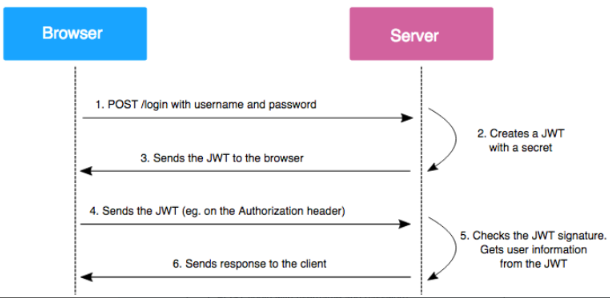

# JWT 토큰

### JWT(JSON Web Token)란

JWT란 토큰 인증 방식에서 쓰이는 것이라고 볼 수 있습니다. 다른 사용으론 데이터를 공유하는데도 사용할 수 있지만 일반적으론 토큰 인증 방식에서 사용됩니다.

### JWT 특징

JWT는 세션 기반 인증과 주로 대비됩니다. 세션기반 인증은 서버에서 세션 정보를 관리해야하는 비용이 들게됩니다. 또한 분산환경에서도 관리하기 어렵습니다. 하지만 JWT는 그 자체로 정보를 가지고 있기 때문에 세션의 단점을 보완할 수 있습니다.

### JWT 구조

JWT는 헤더, 페이로드, 시그니쳐로 구분됩니다. 헤더는 토큰의 타입, 암호화 알고리즘을 담고 있고, 페이로드는 토큰의 정보를 담는 부분이며, 시그니처는 토큰의 정보가 신뢰할 수 있는것인지 판단할 수 있도록 합니다.

### JWT 구현 방식

1. 브라우저에서 로그인을 요청합니다. (ID/PS 전송)
2. 서버의 비밀키를 가지고 JWT를 생성합니다. JWT는 헤더에 토큰 정보와 페이로드에 사용자에 대한 정보, 시그니쳐에 암호화된 정보가 담겨있습니다.
3. 생성한 JWT를 클라이언트에 전달합니다. 클라이언트는 JWT를 브라우저에 저장해둡니다. 클라이언트는 JWT의 페이로드 정보를 사용할 수 도 있습니다.
4. 사용자 인증이 필요한 요청을 보낼때 클라이언트는 JWT토큰을 해더에 포함하여 보냅니다.
5. 서버는 JWT토큰의 시그니처를 확인하고, 정보에 따라서 결과를 반환해줍니다.

### JWT 장단점

- 장점
  - 수평 스케일이 용이
  - 트래픽 대한 부담이 낮음
  - 인증 정보를 담은 저장소 관리 필요 없음
- 단점
  - 서버에서 사용자 정보를 조작할 수 없음.
  - 토큰의 크기가 커지면 전송량이 증가할 수 있음
  - 모바일, PC 등 사용자 기기에 따른 컨트롤이 불가능함
