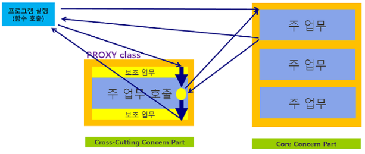

# Spring proxy

### 넓은 범위에서 Proxy란?

Proxy의 사전적 의미는 대리인, 위임인 이라는 의미이다. 개발 세계에서 proxy는 서버에서 많이 사용하며, 클라이언트가 프록시 서버를 통해 다른 네티워크 서비스에 접속할 수 있게 해주는 기능을 말한다. 그 중계하는 기능이 proxy server이다.

이러한 Proxy sever는 또 포워드 프록시, 리버스 프록시 두 가지로 분류됩니다.

- 포워드 프록시
  - Client - Forward Proxy - Internet- Server
  - 특정 사이트에 Client가 요청을 보내면, 내부Forward Proxy를 먼저 확인하고 캐싱된 데이터가 있으면 바로 반환해서 돌려줍니다.
  - Client가 Internet으로 접근하기 전에 Proxy Server를 먼저 지나므로 여기서 유해 사이트 등 차단이 가능합니다.
- 리버스 프록시
  - Client - Internet - Reverse Proxy - Server
  - 서버 앞에서 Proxy Server가 요청을 확인하고 캐싱된 데이터가 있으면 돌려준다. 데이터가 없으면 로드밸런싱하여 서버로 요청을 보낸다.
  - 서버 관리 측면에서 로드밸런싱과 서버 확장에 유리하다.

### Spring Proxy

1. Proxy 호출
2. 보조 업무 처리
3. Proxy 처리 함수(메서드) 가 실제 구현 함수(메서드) 호출 및 주 업무 처리
4. 제어권이 다시 Proxy 함수(메서드)로 넘어오고 나머지 보조 업무 처리
5. 처리 작업 완료 후, 호출 함수(메서드)로 반환.
