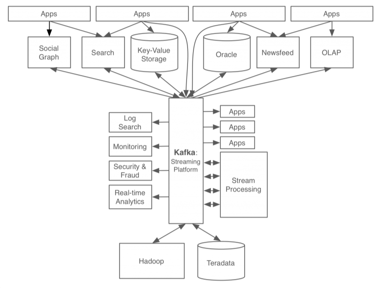
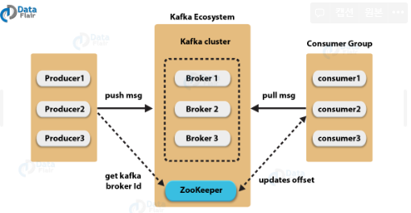

# Spring MSA - Kafka

## Kafka

Kafka는 링크드인에서 메세지 큐 시스템으로 개발되었다. 우선 메시징 시스템에 대해 알아보자

### 카프카를 이용한 데이터 처리

위 그림에서 보듯이 각각의 앱간의 직접 연결되어 있으면 데이터의 흐름 파악이 복잡하다. 이러한 흐름을 통일시키기 위해서 kafka가 사용된다.

메세지는 생산자(Sender/Publisher/Producer)에서 소비자(Reciver/Subscriber/Consumer)로 이동한다. 여기서 직접 어디로 보내는것을 지정하지 않고, 발신자(생산자)는 Kafka로 데이터를 보낸다. 그리고 수신자(소비자)는 구독을 등록했다가 데이터가 오면 메시지를 받는 방법이다. 이러한 방식을 Pub-Sub 형태의 네트워크 통신이라고 한다.

## Kafka 구성요소

### Event

Producer와 Consumer가 데이터를 주고받는 단위이다. 메세지라고 표시하기도 한다.

### Producer / Consumer

Producer는 이벤트를 게시 (post)하는 앱이다. Consumer는 Topic을 구독하고 이로부터 얻어낸 이벤트를 처리하는 클라이언트 앱이다.

### Topic

이벤트가 쓰이는 곳이다. Producer가 Topic에 이벤트를 게시한다. 즉, topic은 이벤트를 저장하는 저장소이다. 이는 메시지를 논리적으로 묶은 개념 (DB 테이블이나 폴더와 유사)이다.

## Kafka 동작 방식

앞서 공부한 내용에서 Broker와 ZooKeeper가 등장했다. Broker는 카프카 앱이 설치되어있는 서버(또는 노드)를 지칭한다. Zookeeper는 분산 어플리케이션 관리를 위한 코디네이션 시스템이다. 노드 정보를 관리한다.

메세지가 들어와서 전달되는 방법을 알아보자.

1. 프로듀서가 새 메시지를 카프카에 전달한다.
2. 전달된 메세지는 브로커의 토픽에 저장된다.
3. 컨슈머는 구독한 토픽에 pull로 데이터를 가져온다.

### 기존 메시징 시스템과 차이

- 디스크에 메시지 저장
  - 기존 시스템과 가장 큰 차이이다. 디스크에 메시지를 저장하는것은 갑작스런 서버 종료에 데이터가 보존된다는 장점이 있다.
  - 메시지는 일정시간 디스크에 보관되어 영속성을 가진다.
- 분산형 스트리밍 플랫폼
  - 단일 시스템 대비 성능이 우수하며, 시스템 확장에 용이하다.
  - 일부 노드가 죽더라도 다른 노드가 해당 업무를 수행 가능하다.
- 페이지 캐시
  - 메세지를 디스크에 저장하는것은 속도 면에서 단점이 된다.
  - Kafka는 이를 해결하기 위해 캐시를 사용하여 처리 속도를 높인다.
- 배치 전송
  - 서버와 클라이언트 사이에서 빈번하게 발생하는 메시지 통신을 하나씩 처리하는 경우 네트워크의 오버헤드가 발생할 수 있다.
  - 이를 해결하기 위해 Kafka는 작은 단위로 묶어서 배치로 처리한다.
