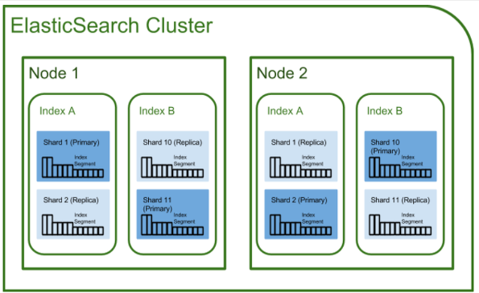
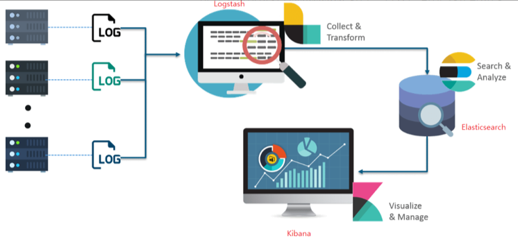

# Spring MSA - ElasticSearch

### 개요

ElasticSearch는 Java 오픈소스 분산 검색 엔진입니다. 빅데이터의 저장, 분석, 검색을 효율적으로 제공해 줍니다. Java기반이기 때문에 JVM에서 동작 가능합니다.

### 검색 이해

검색 기술은 색인(indexing) 검색(search)가 기본이 된다.

- 색인 (indexing)
  - 데이터 검색을 쉽게 하기위해 원본 문서를 검색에 토큰으로 변환하여 저장하는 과정이다.
- 인덱스 (index)
  - 색인 과정을 거친 결과물이다. 또는 색인된 데이터가 저장되는 저장소를 지칭하기도 한다. Elasticsearch에서는 도큐먼트들의 논리적 집합을 표현하는 단위이다.
- 검색 (search)
  - 인덱스에 들어있는 검색에 토큰을 포함하는 문서를 찾아가는 과정이다.
- 질의 (query)
  - 사용자가 원하는 문서를 찾거나, 집계 결과를 출력하기 위해 입력하는 조건 명령문이다.

### Elasticsearch 아키텍처

- Cluster
  - Elasticsearch에 가장 큰 시스템 단위이다.
  - 최소 하나의 노드를 가진다.
  - 서로 다른 클러스터에 접근할 수 없는 독립된 단위이다.
  - 여러대 서버가 하나의 클러스터를 구성 할 수 있고, 한 서버에 여러개의 클러스터가 존재할 수 있다.
- Node
  - 클러스터 내부 하나의 단위 프로세스이다.
  - 역할에 따라서 Master-eligible, Data, Ingest, Tribe 노드로 구분할 수 있다.
    - Master-eligible: 클러스터를 제어하는 마스터 노드 인덱스 생성 및 삭제, 전체 노드 추적 및 관리, 데이터 입력 샤드 할당
    - Data: 데이터의 CRUD 작업을 수행하는 노드 이 노드는 CPU, 메모리 등 자원을 많이 소모하므로 모니터링이 중요하며 master 노드와 분리되는 것이 좋다.
    - Ingest: 데이터를 변환하는 등 사전 처리 파이프라인 실행
    - Coordination only: 로드밸런서와 비슷하게 대규모 클러스터에서 data / master 노드의 일을 대신 수행함
- Index / Shard / Replica
  - Index
    - RDB에서 database와 대응하는 개념이다.
  - Shard
    - 데이터를 분산해서 저장하는 방법이다. 스케일 아웃을 위해 Index를 여러 Shard로 쪼갠다.
  - Replica
    - 또다른 형태의 Shard이다. 노드를 손실할 경우를 대비하여 복제하는 장치이다.
    - 따라서 Replica는 서로다른 노드에 존재하는것이 권장된다.

### Elasticsearch 특징

- Scale out
  - 샤드를 통해 수평 확장이 가능하다
- 고가용성
  - Replica를 통해 데이터 안정성이 보장된다
- Schema free
  - Json문서를 통해 데이터 검색을 수행하여 스키마가 없다
  - NoSQL처럼 데이터 모델을 JSON형태로 저장하고 있다
- RESTful
  - 데이터 CRUD작업은 HTTP REST API를 통해 수행된다. CRUD는 각각 PUT, GET, POST, DELETE에 맵핑된다.

### ELK

Elasticsearch 단독으로 사용되기도 하지만, ELK (Elasticsearch, Logstash, Kibana) 조합으로 많이 사용됩니다.

- Elasticsearch
  - Logstash로부터 받은 데이터를 검색 및 집계하여 필요한 관심 정보 획득
- Logstash
  - 다양한 소스 (DB, csv 등)의 로그나 데이터를 수집, 집계, 파싱하여 Elasticsearch로 전달
  - 원래는 독립된 소프트웨어로 개발되었으나, Elasticsearch를 지원하기 시작하면서 Elasticsearch 입력 수단으로 많이 사용되었다.
- Kibana
  - Elasticsearch의 빠른 검색을 통해 데이터를 시각화 및 모니터링

